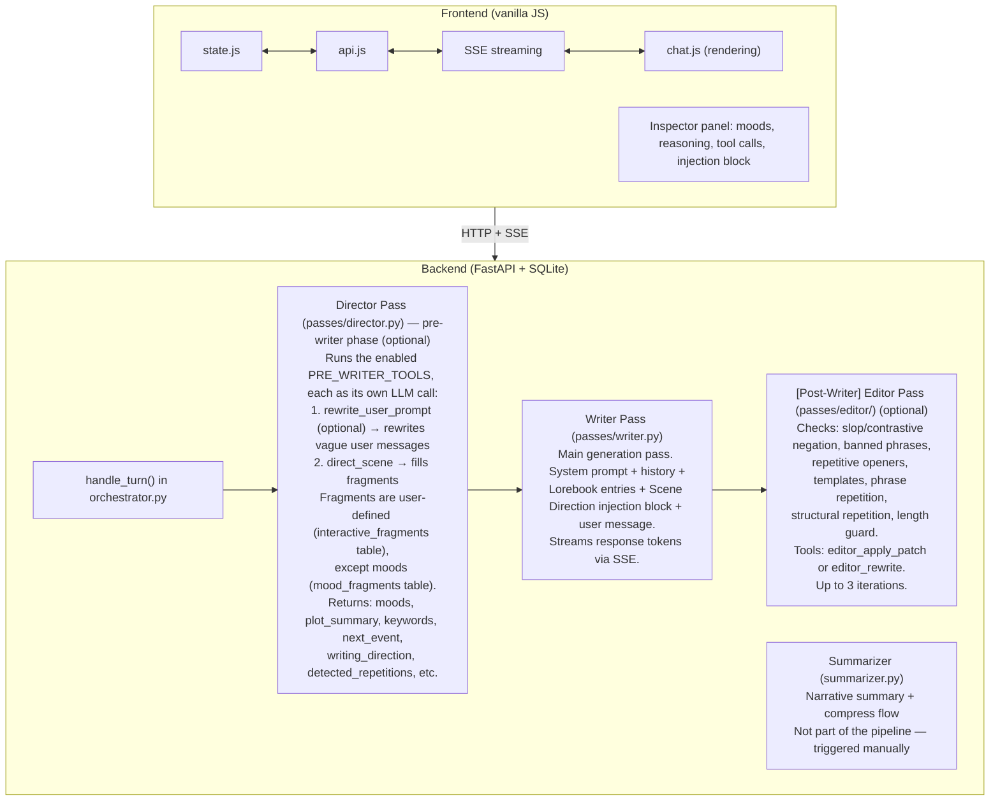
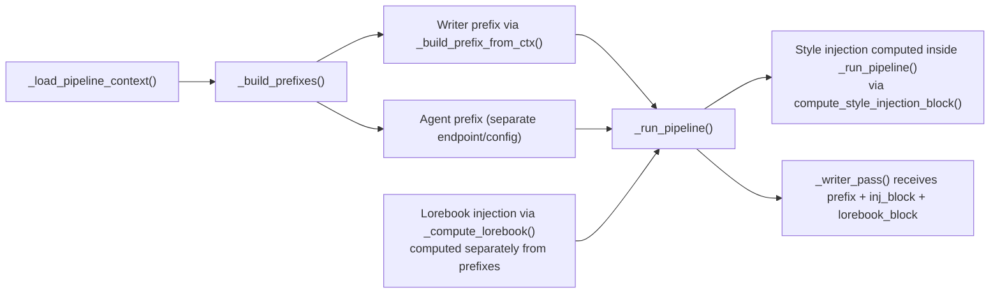
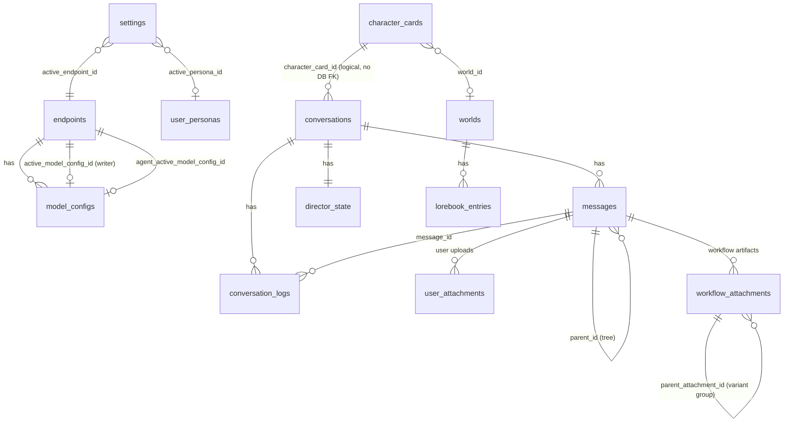
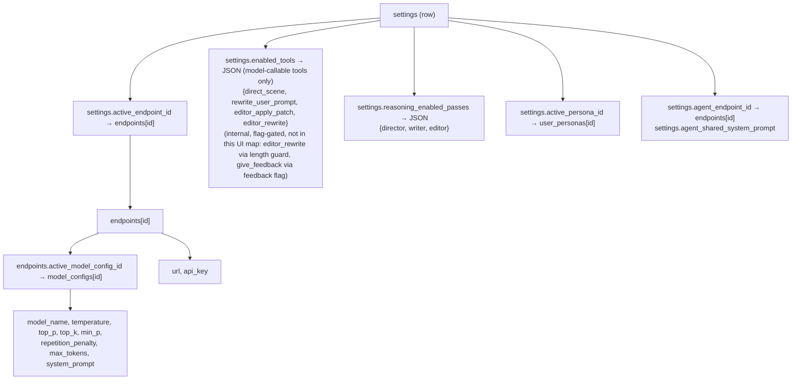

# AGENTS.md — Orb Codebase Guide

> **This is a living document.** Keep it up to date as the codebase evolves. When architectural decisions are made — new pipeline passes, DB schema changes, API additions, shifts in conventions — update the relevant sections here. An outdated AGENTS.md is worse than no AGENTS.md.

## Project Overview

Orb is an **agentic AI roleplay/writing frontend** with a Python/FastAPI backend and a vanilla JS frontend. It orchestrates multi-pass LLM pipelines (Director → Writer → Editor) with tool-calling agents that control scene direction, rewrite prompts, and audit output quality. Characters are imported as PNG cards (V2 spec). Conversations support branching (message tree with parent_id), lorebooks, mood/interactive fragments, and user personas.

**Stack:** Python 3.9+, FastAPI, aiosqlite, vanilla JS (no framework), SQLite DB, uvicorn

## Architecture

> **Cross-pass prompt caching:** The director/writer/editor passes are deliberately built to share one KV-cached prefix (same system prompt, same history, same tool schemas) so each turn stays fast and cheap. The full design — the invariants, dual-model behavior, the editor's ReAct loop, and the KV tracker — lives in [docs/architecture/kv-cache.md](docs/architecture/kv-cache.md). Read it before touching anything that builds prompts, orders passes, or assembles tool schemas, and keep cache details there rather than duplicating them here.

> **Secondary workflows:** Pluggable workflows hook into the turn pipeline (pre/post), emit on-demand HTTP responses, and persist per-message artifacts — registered in `backend/workflows/` with frontend modules in `frontend/workflows/`. The full framework reference (registration, hook contexts, locks, the toolkit import surface, attachment cache, HTTP routes, and the frontend state surface), along with the shipped workflows, lives in [docs/architecture/secondary-workflow.md](docs/architecture/secondary-workflow.md). Start from that doc rather than re-deriving the framework here.



### Pipeline Context Flow



## Directory Structure

```
Orb/
├── backend/
│   ├── main.py              # FastAPI app: all API routes, Pydantic models
│   ├── orchestrator.py      # Pipeline orchestration: handle_turn, _run_pipeline
│   ├── database/            # DB package (aiosqlite). __init__.py re-exports the
│   │                        # full public API for backwards-compatible imports.
│   │   ├── models.py        # Model layer: TypedDict row contracts + PhraseGroup;
│   │   │                    # depends on nothing else (see Data Contracts below)
│   │   ├── connection.py    # DB_PATH, get_db() async context manager, _build_set_clause
│   │   ├── schema.py        # CREATE TABLES script
│   │   ├── seeds.py         # SEED_* / DEFAULT_* constants
│   │   ├── bootstrap.py     # init_db() (schema + inline ALTERs + seed inserts), reset_to_defaults()
│   │   ├── queries/         # Per-domain CRUD modules (one file per table group)
│   │   └── migrations/      # DB migrations scripts + run_pending() runner
│   ├── llm_client.py        # LLM API client (OpenAI-compatible), streaming, reasoning
│   ├── prompt_builder.py    # System prompt assembly, style injection, lorebook injection
│   ├── tool_defs.py         # Tool schemas (direct_scene, rewrite, editor tools), constants
│   ├── endpoint_profiles.py # Per-provider quirks (url patterns, body transforms)
│   ├── tavern_cards.py      # PNG card import (tEXt chunk extraction, V2 spec parsing)
│   ├── card_downloader.py   # Download character cards from external sources (CharacterHub, etc.)
│   ├── summarizer.py        # Narrative summary generation + compress flow
│   ├── macros.py            # Macro resolution ({{user}}, {{char}}, {{roll}}, etc.)
│   ├── kv_tracker.py        # Debug: logs messages/tools to JSON for inspection
│   ├── presets.py           # Preset/backup engine: selective export, merge-import,
│   │                        # full snapshots/restore (sqlite ATTACH + VACUUM INTO)
│   ├── locks.py             # Cross-module asyncio locks (workflow_state / character_state / config / maintenance)
│   ├── utils.py             # Shared utilities
│   ├── passes/
│   │   ├── director.py      # Director pass: LLM calls direct_scene tool
│   │   ├── writer.py        # Writer pass: main streaming generation
│   │   └── editor/
│   │       ├── editor.py    # Editor orchestrator: audit → patch/rewrite loop
│   │       ├── audit.py     # Phrase bank matching, opener/template detection
│   │       ├── slop_detector.py       # Regex-based banned phrase detection
│   │       ├── opening_monotony.py    # Repetitive sentence opener detection
│   │       ├── template_repetition.py # Part-of-speech pattern repetition
│   │       ├── structural_repetition.py # Same paragraph layout as previous msgs
│   │       └── contrastive_negation.py # "not X, but Y" cliché detection
│   ├── workflows/           # Secondary workflow framework + shipped workflows
│   │   │                    # (see docs/architecture/secondary-workflow.md)
│   │   ├── __init__.py      # Registration site: register_workflow + subscribe + finalize_registry
│   │   ├── registry.py      # Workflow dataclass, subscriptions, state-store wrappers
│   │   ├── contracts.py     # HookType enum + per-hook Ctx dataclasses, ToolSpec
│   │   ├── toolkit.py       # Stable author import surface (LLM, prompts, DB readers, state, locks)
│   │   ├── _forced_call.py  # forced_tool_call(): one-shot single-tool forced LLM call
│   │   ├── attachment_cache.py # Byte-budget LRU-3 artifact cache (insert/rehydrate/evict/siblings)
│   │   └── tts/             # Shipped TTS workflow
│   │       ├── __init__.py  # Workflow(...) instance
│   │       ├── hooks.py     # post_pipeline / on_demand / regenerate / reroll_gen hooks
│   │       ├── synth.py     # Synthesis driver
│   │       └── engine/      # Per-provider TTS adapters (edge, elevenlabs, fish, kokoro, openai)
│   └── data/                # Runtime: app.db (SQLite)
├── frontend/
│   ├── index.html           # Single-page app shell
│   ├── app.js               # Bootstrap: wire up sidebar, tabs, modals
│   ├── state.js             # Global state object (S.*), reactive getters
│   ├── api.js               # All fetch() calls to backend
│   ├── chat.js              # Chat rendering, message display, Inspector, streaming
│   ├── library.js           # Character card grid/list, CRUD UI
│   ├── presets.js           # Presets/backups UI: export, import, apply, restore, snapshot library
│   ├── settings.js          # Settings panel, endpoint/model config UI
│   ├── lorebooks.js         # World/lorebook entry management
│   ├── modal.js             # Generic modal utilities
│   ├── mobile.js            # Mobile-specific handlers
│   ├── utils.js             # $() helper, esc(), debounce, etc.
│   ├── validate.js          # Input validation helpers
│   ├── tabLock.js           # Browser tab visibility lock
│   ├── workflow_loader.js   # Boot loader: dynamic-imports each workflow's index.js
│   ├── workflow_segmentation.js     # .seg span wrapper enabling text effects / click handlers
│   ├── workflow_text_effects.js     # startTextEffect / clearTextEffect paint loop
│   ├── workflow_text_interaction.js # Click routing + multi-claimant chooser
│   ├── default_widget.js    # Fallback MIME-routed attachment renderer (image/audio/video)
│   ├── audio_player.js      # playAudio + channel controls (TTS playback)
│   ├── audio_schedule.js    # Pure audio scheduling math
│   ├── audio_transport.js   # Transport bar mount (channel selector + controls)
│   ├── style.css            # Main stylesheet
│   ├── mobile.css           # Mobile breakpoints
│   ├── fonts.css            # Custom font declarations
│   ├── fonts/               # Self-hosted: Crimson, Exo2, Lora, Playfair, Spectral, Fira Code
│   ├── themes/              # 9 CSS theme files
│   └── workflows/           # Frontend secondary workflow modules
│       └── tts/             # Shipped TTS frontend (index, widget, karaoke, config_panel, extract, tts.css)
├── docs/
│   ├── index.md             # Docs home / table of contents
│   ├── getting-started.md   # Install & first run
│   ├── contributing.md      # Contributor guide
│   ├── architecture/
│   │   ├── kv-cache.md      # How Orb reuses the LLM KV cache across passes & turns
│   │   └── secondary-workflow.md # Workflow framework dev guide
│   ├── features/            # Per-feature guides (director, anti-slop, length-guard,
│   │                        # compress-history, magic-rewrite, super-regenerate, mobile, tts)
│   └── assets/              # Doc images
├── tests/
│   ├── unit/                # Unit tests (editor, fragments, etc.)
│   └── integration/         # Integration tests (FastAPI TestClient)
├── scripts/
│   ├── tests.sh             # Run test suites
│   ├── format_backend.sh    # Black formatting
│   ├── format_frontend.sh   # Biome formatting
│   ├── lint.sh              # Linting
│   ├── compatibility_test.sh # Version compat checks
│   ├── security_check.sh   # Security scan
│   └── dump_diagnostic.py   # DB state dump for debugging
├── requirements.txt
├── requirements-dev.txt
├── package.json           # Node deps (Lefthook, Biome)
├── biome.json             # Frontend formatter/linter config
├── pytest.ini             # Pytest configuration
├── lefthook.yml           # Git hooks (auto-format on commit)
├── run_unix.sh            # Start backend (Unix)
├── run_windows.bat        # Start backend (Windows)
├── CONTRIBUTING.md
└── README.md
```

## Database Schema

### Core Tables

| Table | Purpose | Key Columns |
|-------|---------|-------------|
| `settings` | Global singleton config (id=1) | endpoint_url, model_name, enabled_tools (JSON — registered tools only), length_guard_* (enabled/enforce/max_words/max_paragraphs), reasoning_enabled_passes, active_persona_id, active_endpoint_id, agent_*, workflow_config (JSON), attachment_cache_budget_bytes, attachment_access_counter |
| `endpoints` | LLM API endpoints | url, api_key, active_model_config_id, agent_active_model_config_id → model_configs.id |
| `model_configs` | Per-endpoint model settings | endpoint_id, model_name, temperature, top_p, top_k, min_p, repetition_penalty, max_tokens, system_prompt, role |
| `conversations` | Chat sessions | character_card_id, character_name, character_scenario, post_history_instructions, active_leaf_id → messages.id, workflow_state (JSON) |
| `messages` | All messages (tree branching via parent_id) | conversation_id, role (user/assistant), content, turn_index, parent_id → messages.id, progressive_fields (JSON), created_at, workflow_state (JSON) |
| `character_cards` | Imported/created characters (V2 spec) | name, description, personality, scenario, first_mes, mes_example, system_prompt, avatar_b64, world_id, workflow_state (JSON) |
| `user_personas` | User profiles injected into system prompt | name, description, avatar_color |

### Agent/Auditor Tables

| Table | Purpose | Key Columns |
|-------|---------|-------------|
| `director_state` | Per-conversation Director memory | conversation_id (PK), active_moods (JSON), keywords (JSON), progressive_fields (JSON) |
| `interactive_fragments` | Dynamic Director parameters | id, label, description, field_type, required, enabled, injection_label, sort_order |
| `mood_fragments` | Named mood presets | id, label, description, prompt_text, negative_prompt, enabled |
| `phrase_bank` | Banned phrases for editor audit | id, variants (JSON array of strings) |
| `conversation_logs` | Per-turn Director audit trail | conversation_id, turn_index, message_id, agent_raw_output, tool_calls (JSON), active_moods_after, progressive_fields_after (JSON), injection_block, agent_latency_ms |

### World/Lorebook Tables

| Table | Purpose | Key Columns |
|-------|---------|-------------|
| `worlds` | Lorebook containers | name, enabled |
| `lorebook_entries` | Keyword-triggered context injections | world_id, name, content, keywords (JSON), case_insensitive, priority, enabled |

### Supporting Tables

| Table | Purpose |
|-------|---------|
| `user_attachments` | User-uploaded images attached to messages (mime_type, data_b64, filename, size). Surfaced on a message dict as `user_attachments`. |
| `workflow_attachments` | Byte artifacts produced by secondary workflows. Two-level variant/sibling groups (`parent_attachment_id`, `active_sibling_id`), backed by an LRU-3 byte-budget cache with eviction (`seed`, `generation_metadata`, `consumption_metadata`, `recent_accesses`; `data_b64` becomes `[evicted]` when evicted). See [secondary-workflow.md](docs/architecture/secondary-workflow.md) §9. |
| `message_attachments` | **Vestigial.** Kept in the base schema only because migration 0002 deletes from it on fresh install before any table-creating migration runs. Migration 0020 copies surviving rows into `user_attachments` and **drops** this table — no rows persist in a fully-migrated DB. |

### Relationships



### Presets & Backups

`backend/presets.py` exports, imports, and snapshots the database as standalone
SQLite `.db` files (built with `VACUUM INTO`, merged via `ATTACH`). Tables are
grouped into coarse **domains** (`characters`, `chats`, `lorebooks`, `fragments`,
`phrase_bank`, `configs`); a *preset* carries a chosen subset, a *snapshot* is a
full-domain preset, and both live in one on-disk library described by an
`orb_preset_meta` row. Two ways data crosses back in: **apply** (merge by
identity — UUID rows upsert, child collections replace wholesale, integer-PK rows
reinsert with remapped references) and **restore** (roll back to the file — a
full-coverage file is swapped in whole via `restore_full`; a partial file is
restored *domain-scoped* via `restore_partial`/`apply_preset(replace=True)`,
which empties each covered domain before the merge so those domains match the
file exactly while uncovered ones are untouched). Both work on any library file —
imported ones included; restore's auto-snapshot makes the overwrite reversible.
**Import** is non-destructive: it just lands an external `.db` in the library
(the user then applies or restores it). Destructive ops auto-snapshot first.

The single source of truth for *which tables belong to which domain* is the
`DOMAIN_TABLES` map at the top of `presets.py`. **When you add a table** (or a
table sprouts a cross-domain FK), update that map and the per-domain merge logic
there — keep the domain grouping current rather than expanding this section. Runs
synchronously off the event loop via `asyncio.to_thread` under
`backend.locks.maintenance_lock`.

## Data Contracts (the model layer)

`backend/database/models.py` is the **model layer**: domain data contracts (a `TypedDict` per table-group row, plus the `PhraseGroup` union — `list[str] | LiteralPhraseGroup | RegexPhraseGroup`, a discriminated union keyed on `kind`) that describe the *shape* of persisted data and depend on nothing else in the codebase. The dependency rule is one-way — every other layer points its dependencies **inward**, toward the data, and `backend/database/` must never import "up" into `passes/`, `orchestrator.py`, or `workflows/`. (The introducing commit moved `PhraseGroup` *down* into `models.py` from `slop_detector.py` to kill the last upward import; anything in `database/` that reaches up for a shared shape is an architectural inversion — put the shape here instead.) When the database layer genuinely needs higher-layer *behavior* at a fixed seam — `add_message` persisting workflow attachments inside its own write transaction — it declares the contract and the higher layer registers an implementation (dependency inversion): `database/queries/messages.py` owns `register_workflow_attachment_persister`, and `workflows/attachment_cache.py` registers `insert_workflow_attachments` into it at import. Don't reintroduce a lazy `import backend.workflows` inside a `database/` function to dodge the rule — that hides the inversion from the import graph without removing it.

- **The TypedDicts label plain dicts, with zero runtime change.** The query layer still returns ordinary `dict(row)` objects; each query stamps the shape at its boundary with `cast(SomeRow, ...)` (a `TypedDict` is not assignable from a bare `dict`). So `row["col"]` access is checked against the schema without any wrapper object, validation, or runtime cost. Each `queries/*.py` module imports just the contract(s) for its tables (`SettingsRow`, `ConversationRow`/`ConversationListRow`, `MessageRow`/`MessageWithAttachments`, `EndpointRow`, `ModelConfigRow`, `WorldRow`, `LorebookEntryRow`, `CharacterCardRow`, `DirectorStateRow`, `InteractiveFragmentRow`, `MoodFragmentRow`, `UserPersonaRow`, `ConversationLogRow`, `PhraseBankRow`, and the attachment rows).
- **Every row-shaped query return is typed; only free-form blobs stay `dict`.** A query that returns table rows uses a contract. The lone exception is the per-workflow JSON state/config accessors (`get_workflow_state`, `get_workflow_message_state`, `get_workflow_character_state`, `get_workflow_config`) — these decode an arbitrary per-workflow slot with no fixed schema, so they correctly return bare `dict`/`dict | None`. Don't invent a contract for those.
- **JSON columns are typed as their *decoded* shape** (`dict`/`list`) **only on the queries that actually decode them.** Where a query leaves the column as a raw JSON string it stays `str` — e.g. `MessageRow.progressive_fields` is `dict` because `get_path_to_leaf()` decodes it, while `get_message_by_id()` leaves it a string; `ConversationLogRow` decodes `tool_calls`/`active_moods_after` to lists but leaves `progressive_fields_after` a raw string. The label makes those pre-existing inconsistencies visible rather than fixing them.
- **SQLite has no boolean type**, so flag columns (`enabled`, `required`, `case_insensitive`, `constant`, …) are typed `int` to match the 0/1 that `dict(row)` returns — not `bool`.
- **`total=False`** marks contracts whose keys are only conditionally present: the `DEFAULT_SETTINGS` fallback vs the `SELECT *` branch, the column subsets different readers project, and the attachment/branch-nav metadata glued on after the base row.
- **Required base + optional extension** is the idiom when one reader projects a strict superset of another's columns: a `total=True` base holds the always-present keys (so consumers can subscript them) and a subclass adds the rest. `_SettingsBase` → `SettingsRow`, and `WorkflowAttachmentRowBase` → `WorkflowAttachmentRow` (the base is what `get_workflow_attachments_for_message()` returns — it omits the redundant `message_id` it filters on; the full row that single-row and glue readers return adds it).
- **The write side mirrors the read side.** `SettingsRow` ⇄ the Pydantic `SettingsUpdate` in `main.py`; `database/schema.py` is the source of truth for columns. When you add, rename, or retype a column, update all three (schema, the row contract, the write-side Pydantic model) in lockstep.

### Type checking (pyright)

`pyrightconfig.json` runs pyright in **standard** mode over `backend/` (target Python 3.12, missing imports downgraded to warnings), and the **whole backend passes clean — zero errors, no file-level suppressions.** (An earlier stage suppressed four rules in `main.py`/`orchestrator.py` while the row TypedDicts were threaded through bare-`dict` helpers; those suppressions are gone now that the consumer signatures were widened.) Keep it at zero:

- **Widen consumers, don't re-tighten producers.** When a typed row flows into a helper, the helper takes `Mapping[str, Any]` (read-only dict) and `Sequence[Mapping[str, Any]]` (read-only list), not bare `dict`/`list[dict]` — `list[SomeRow]` is *not* assignable to `list[dict]` (list is invariant), but it *is* to `Sequence[Mapping[str, Any]]` (covariant). The pipeline already types `history`, `settings`, and the fragment lists this way; `attachments` now matches. Use the concrete `dict`/`list[dict]` only where the code actually mutates the value (e.g. the attachment-cache writer tags and copies dicts — `add_message` materializes `dict(att)` at that boundary).
- **Don't add suppressions to dodge a type error** — fix the contract or widen the consumer. A `# pyright: ignore` or file-level `# pyright:` header reintroduced here is a regression.

## API Endpoints

### Settings & Config
- `GET /api/settings` / `PUT /api/settings` — Global settings singleton
- `GET /api/endpoints` / `POST /api/endpoints` — List/create endpoints
- `GET/PUT/DELETE /api/endpoints/{id}` — CRUD single endpoint
- `GET/POST /api/endpoints/{id}/models` — List/create model configs
- `PUT/DELETE /api/models/{id}` — Update/delete model config

### Conversations
- `GET /api/conversations` / `POST /api/conversations` — List/create
- `PUT/DELETE /api/conversations/{cid}` — Update/delete
- `POST /api/conversations/{cid}/touch` — Update timestamp
- `POST /api/conversations/{cid}/summarize` — SSE stream narrative summary
- `POST /api/conversations/{cid}/compress` — Create compressed continuation
- `POST /api/conversations/{cid}/stop` — Abort generation
- `GET /api/conversations/{cid}/context-size` — Estimated context token count

### Messages
- `GET /api/conversations/{cid}/messages` — Active message path with branch navigation metadata (branch_count, branch_index, prev/next branch IDs)
- `POST /api/conversations/{cid}/send` — Send message (SSE stream response)
- `POST /api/conversations/{cid}/continue` — Regenerate from last user msg
- `POST .../messages/{id}/edit` — Edit message content
- `POST .../messages/{id}/fork-edit` — Fork at a user message: persist edited sibling and stream a fresh reply (SSE)
- `DELETE .../messages/{id}` — Delete message, its siblings, and all descendants
- `POST .../messages/{id}/switch-branch` — Switch active branch
- `POST .../messages/{id}/regenerate` — Regenerate single response
- `POST .../messages/{id}/super_regenerate` — Regenerate keeping prior as context
- `POST .../messages/{id}/magic_rewrite` — Rewrite with custom instruction

### Characters
- `GET /api/characters` / `POST /api/characters` — List/create
- `POST /api/characters/import` — Import from PNG (multipart upload)
- `POST /api/characters/import-url` — Download a card from an external source and run it through the import parse pipeline
- `GET /api/characters/browse` — Proxy external card-search providers (`source`, `q`, `page`); avoids browser CORS
- `GET /api/characters/randomize` — Randomized selection from a source that supports it
- `GET/PUT/DELETE /api/characters/{id}` — CRUD
- `GET /api/characters/{id}/avatar` — Serve avatar image
- `GET /api/characters/{id}/export` — Export as PNG card

### Fragments & Moods
- `GET/POST /api/fragments` — List/create mood fragments
- `PUT/DELETE /api/fragments/{fid}` — Update/delete mood fragment
- `GET/POST /api/interactive-fragments` — List/create interactive fragments
- `PUT/DELETE /api/interactive-fragments/{fid}` — Update/delete interactive fragment

### Worlds & Lorebooks
- `GET/POST/PUT/DELETE /api/worlds` — Worlds CRUD
- `GET/POST /api/worlds/{id}/entries` — List/create lorebook entries
- `GET/PUT/DELETE /api/worlds/{id}/entries/{entry_id}` — CRUD single entry
- `POST /api/worlds/{id}/import` — Import lorebook (standalone JSON or Tavern V2 character_book.entries)
- `GET /api/lorebook-entries/active` — All enabled entries from enabled worlds

### Phrase Bank
- `GET /api/phrase-bank` / `POST /api/phrase-bank` — List/create
- `PUT/DELETE /api/phrase-bank/{id}` — Update/delete

### Personas
- `GET/POST /api/user-personas` — List/create
- `PUT/DELETE /api/user-personas/{id}` — Update/delete

### Inspector
- `GET /api/conversations/{cid}/director` — Director state
- `GET /api/conversations/{cid}/logs` — Conversation logs
- `GET /api/conversations/{cid}/messages/{id}/director-log` — Per-message Director log

### Secondary Workflows
See [docs/architecture/secondary-workflow.md](docs/architecture/secondary-workflow.md) §8 for per-route contracts (bodies, locks, error codes).
- `GET /api/workflows` — Manifest: `[{id, display_name, config_schema, config_defaults}]` (registration order)
- `GET/PUT /api/workflows/{wid}/config` — Read/write a workflow's global config slot
- `POST /api/conversations/{cid}/workflows/{wid}/trigger` — Fire a workflow's on-demand hook out of turn
- `POST .../messages/{mid}/workflow-attachments/{aid}/regenerate` — Produce new artifact variants (REGENERATE hook)
- `POST .../messages/{mid}/workflow-attachments/{aid}/reroll-gen` — Produce one new sibling variant (REROLL_GEN hook)
- `POST .../messages/{mid}/workflow-attachments/{aid}/rehydrate` — Re-synthesize an evicted artifact in place (REROLL_GEN hook)
- `POST .../messages/{mid}/workflow-attachments/{aid}/activate` — Select the active sibling in a variant group
- `POST .../messages/{mid}/workflow-attachments/{aid}/delete` — Delete a variant or the whole group (`scope`)
- `POST /api/conversations/{cid}/workflow-attachments/access` — Record artifact access (drives LRU-3 eviction order)

### Presets & Backups
- `GET /api/presets` — List the snapshot library (exports, imports, auto-backups)
- `POST /api/presets/export` — Build a preset from selected domains (`domains`, `strip_keys`, `label`)
- `GET /api/presets/{name}/download` — Download a library file
- `POST /api/presets/import` — Upload an external `.db` into the library (non-destructive; apply/restore separately)
- `POST /api/presets/{name}/apply` — Merge a library file's data by identity (auto-snapshots first)
- `POST /api/presets/{name}/restore` — Roll back to a library file: full-file replace for full-coverage backups, domain-scoped wholesale replace for partial ones (imported included; auto-snapshots first)
- `DELETE /api/presets/{name}` — Delete a library entry

### Other
- `GET /` — Serve frontend (SPA shell)
- `GET /api/themes` — Available CSS themes
- `POST /api/reset` — Factory reset (confirm required)

## Configuration Chain



Multiple model configs per endpoint. Active one selected via `endpoints.active_model_config_id`. Agent (Director) can use a separate endpoint (`agent_endpoint_id`) or share the writer's.

## Single-Model vs Dual-Model Mode

Orb routes its pipeline passes (Director → Writer → Editor) in one of two modes, controlled by `settings.agent_same_as_writer` (default `true`). "Agent" here means the **Director and Editor** passes; the Writer is always the main generation pass.

### Single-model mode (default — `agent_same_as_writer = true`)

All three passes run on the **same** endpoint and model — the Writer's (`settings.active_endpoint_id` → `endpoints.active_model_config_id`). Every pass sends the same system prompt, the same history, and the same tool schemas, so they share **one KV-cached prefix** on a single inference server. This is the configuration the cross-pass cache design is built around — see [docs/architecture/kv-cache.md](docs/architecture/kv-cache.md). (Caveat: a per-pass `reasoning_enabled_passes` split — the default has the Director thinking and the Writer/Editor not — forks that one prefix into separate caches on backends that route thinking-on/off differently, e.g. DeepSeek, so the passes stop sharing *within* a turn. See that doc's §9 and the [animation](docs/kv-cache-animation.html).)

### Dual-model mode (`agent_same_as_writer = false` + `agent_endpoint_id` set)

The agent passes (Director + Editor) run on a **separate** endpoint/model from the Writer:

| Aspect | Single-model | Dual-model |
|--------|--------------|------------|
| Director/Editor endpoint | Writer's endpoint | `settings.agent_endpoint_id` |
| Director/Editor model | Writer's `active_model_config_id` | endpoint's `agent_active_model_config_id` |
| Agent system prompt | Writer's system prompt | `settings.agent_shared_system_prompt` (own prefix) |
| Writer tool schemas | All enabled schemas (sent for byte-parity) | **None** — writer drops its tool list |
| KV cache | One shared prefix across all passes | Writer prefix on writer server; agent prefix shared by Director + Editor on the agent server |

Because the writer's KV cache now lives on a different server than the agent passes, shipping tool schemas (or the OOC "no tools" notice) to the writer buys nothing, so the writer drops them. The Director and Editor still share a cache with each other, built from their own `agent_prefix` (agent system prompt + history). The cross-pass hand-off into the editor's first iteration also differs in dual-model — see Invariant 5 and the editor ReAct-loop section of [docs/architecture/kv-cache.md](docs/architecture/kv-cache.md) for the full caching consequences.

### Where it lives in code

- **Resolution** — `_load_pipeline_context()` in `orchestrator.py` builds `agent_client` and `agent_system_prompt` only when `not agent_same_as_writer and agent_endpoint_id`; `_build_prefixes()` builds the separate `agent_prefix`.
- **Routing** — the Director and Editor run on `agent_client or client` with `agent_prefix or prefix`; when `agent_client` is set, `writer_enabled_tools` is forced to `{}` (`orchestrator.py`).
- **Config** — `settings.agent_same_as_writer`, `settings.agent_endpoint_id`, `settings.agent_shared_system_prompt`, and `endpoints.agent_active_model_config_id`.
- **UI** — Settings → Endpoints → **Agent** section → "Same as Writer" toggle (`frontend/settings.js`). Unchecking reveals the agent endpoint/model fields and warns if they exactly match the writer's (which would make the split pointless).

## Frontend Architecture

- **State** (`state.js`): Single global `S` object. No reactive framework — components call `render*()` functions after state mutations.
- **Rendering** (`chat.js`): `renderMessages()` rebuilds the entire message list from `S.messages`. Inspector panel rendered by `renderInspector()`.
- **Streaming**: SSE events parsed in `chat.js` — `director_start`, `director_done`, `prompt_rewritten`, `token`, `reasoning`, `writer_rewrite`, `editor_done`, `user_message_created`, `done`, `error`, plus workflow-driven events (`phase_status` for the phase pill, `workflow_attachments_rejected`, and any custom passthrough event a workflow hook yields, dispatched via `S.workflowEventHandlers`). `_result`, `_refined_result`, and other underscore-prefixed events are backend-internal, consumed before reaching the frontend. Tokens accumulate into the current message div in real-time.
- **API** (`api.js`): All backend calls via `fetch()`. SSE streams handled by `EventSource`-like parsing in `chat.js`.
- **Branching**: Messages use `parent_id` forming a tree. `conversations.active_leaf_id` selects the visible leaf. UI shows branch count/index with prev/next navigation buttons.

## Context Management

Orb sends the **full active message path** (leaf to root) every turn — no automatic truncation or rolling window. Inactive sibling branches are not included.

- `updateContextCounter()` calls `GET /api/conversations/{cid}/context-size` which computes a per-component token breakdown (system prompt, persona, scenario, messages, director injection, lorebook, post-history) using `chars / 4` per component
- **Manual compress flow**: `POST /summarize` → LLM writes narrative summary → user reviews → `POST /compress` → creates new conversation with summary + last N messages
- No RAG, no background compaction, no automatic summarization

## Testing

- **Unit tests** (`tests/unit/`): Test individual functions — editor audit, fragment parsing, template detection, abort logic.
- **Integration tests** (`tests/integration/`): FastAPI `TestClient` against real DB — CRUD for characters, conversations, endpoints, settings, fragments, personas, context size.
- **Run**: `cd ~/repos/Orb && ./scripts/tests.sh all`
- **No e2e tests** for the frontend.

### Codex Sandbox Caveat

When running under Codex's filesystem/network sandbox, `aiosqlite` integration tests can hang before the first test body runs. The sandbox stalls `sqlite3.connect()` when it is executed from `aiosqlite`'s worker thread. This is a Codex execution-environment limitation, not an Orb database bug.

- Unit tests that do not initialize the async DB can run normally in the sandbox.
- Integration tests, app startup checks, and any command calling `init_db()` from the `backend.database` package should be run with Codex escalated execution (`sandbox_permissions: "require_escalated"`).

## Common Development Workflows

### Adding a New Tool

A *tool* is a model-callable function schema. `settings.enabled_tools` holds
**only** tools — `update_settings` sanitizes the JSON against the `TOOLS` registry,
so a non-tool key there is dropped on save. For a UI toggle that is *not* a model
function (a "feature flag"), see the next subsection instead.

1. Define the tool schema in `tool_defs.py` (OpenAI function-calling format)
2. Register in `TOOLS` dict with `choice` and `schema` entries
3. Add to `PRE_WRITER_TOOLS` or `POST_WRITER_TOOLS` sets
4. Handle the tool call response in the relevant pass
5. Add toggle in `settings.enabled_tools` (key == tool name) and the frontend `TOOL_DEFS` panel

### Adding a Feature Flag (non-tool toggle)

For a pipeline/UI feature that is *not* a model function (e.g. the length guard):

1. Add a dedicated `settings` column (boolean → `INTEGER NOT NULL DEFAULT 0`) in
   `database/schema.py`, `database/seeds.py`, and a numbered migration
2. Add it to the `allowed` list in `database/queries/settings.py` and the
   `SettingsUpdate` model in `main.py`
3. Read it from `settings` (not `enabled_tools`) in the pipeline
4. Persist it as a top-level field from the frontend (not via `enabled_tools`)

### Adding a New Secondary Workflow

See [docs/architecture/secondary-workflow.md](docs/architecture/secondary-workflow.md) for the full guide to authoring a secondary workflow — registration, hook contexts, HTTP routes, and the frontend module surface.

### Adding a New Theme

1. Create `frontend/themes/your_theme.css`
2. Follow the pattern of existing themes — CSS custom properties on `[data-theme="your_theme"]`
3. The theme is automatically listed via `GET /api/themes`

### Formatting and linting the code

1. Format backend code with Black: ./scripts/format_backend.sh
2. Format frontend code with Biome: ./scripts/format_frontend.sh
3. Lint both backend and frontend and check for static issues: ./scripts/lint.sh

## Gotchas and Pitfalls

1. **Message tree branching** — Messages use `parent_id` to form a tree. `conversations.active_leaf_id` marks the visible leaf. The API returns branch navigation metadata (branch_count, branch_index, prev/next IDs). Deleting a message cascades to all descendants.

2. **Streaming lifecycle** — SSE connections must be properly cleaned up. The `_CleanupStreamingResponse` wrapper handles client disconnects. The `stop` endpoint sets an abort flag checked between pipeline stages. The abort logic is complex (aborting mid-writer stream must also save partial output to DB) and may need an audit.

3. **Tool call parsing** — The Director pass parses JSON tool call arguments. Malformed JSON from the LLM can crash the pipeline. Error handling wraps these in try/except but edge cases exist.

4. **SQLite + aiosqlite** — All DB operations are async via aiosqlite. No ORM — raw SQL inside `backend/database/queries/`, one module per table group. Rows come back as plain `dict(row)` objects, `cast(...)` to the `TypedDict` contracts in `database/models.py` at the query boundary (see **Data Contracts** above) — there is no runtime row class. The package's `__init__.py` re-exports every public function so callers can keep importing from `backend.database` directly. Migrations run sequentially by number prefix.

5. **Endpoint profiles** — Middleware layer to handle unsupported params where the provider returns an error instead of ignoring them. Not every provider needs its own profile — only add one when a provider's API quirks require body transformation.

6. **Reasoning models** — Some models emit `reasoning_content` before `content`. The streaming handler separates these. `reasoning_enabled_passes` in settings controls which pipeline passes get reasoning enabled.

7. **Patching `DB_PATH` in tests** — The canonical `DB_PATH` lives in `backend/database/connection.py`. Tests must patch `backend.database.connection.DB_PATH` (which is what `get_db()` reads). Patching the package re-export `backend.database.DB_PATH` will *not* reach the connection module. See `tests/integration/conftest.py` for the working pattern.

8. **Phrase bank format** — `phrase_bank.variants` is a JSON array of strings. The editor audit matches these against response text using case-insensitive regex.

9. **Lorebook scan depth** — Hard-coded to 6 messages (`LOREBOOK_SCAN_DEPTH` in `prompt_builder.py`). Only the last 6 messages are scanned for lorebook keyword matches.

10. **Macros resolve at different levels** — `resolve_message()` expands everything ({{user}}, {{char}}, inline macros like {{roll}}). `resolve_prompt()` only does {{user}}/{{char}} substitution. Use `resolve_prompt()` for historical messages where inline macros shouldn't fire. `macros.py` is a **dependency-free leaf** (it imports nothing else in the codebase — like `database/models.py` and `llm_types.py`): it transforms strings and message dicts, and knows nothing about the LLM client. The transport-boundary catch-all that scrubs `{{user}}`/`{{char}}` from *every* outgoing message (the director's tool prompt embeds user-authored fragment text that can carry `{{char}}`) is `Macros.resolve_prompt_messages`, wired in as the `CachedBase.resolve` hook in `kv_tracker.py` — applied to `[*prefix, *trailing]` right before the call, so the KV tracker snapshots the exact resolved bytes sent. There is **no** macro-resolving `LLMClient` subclass/wrapper; don't reintroduce one.
