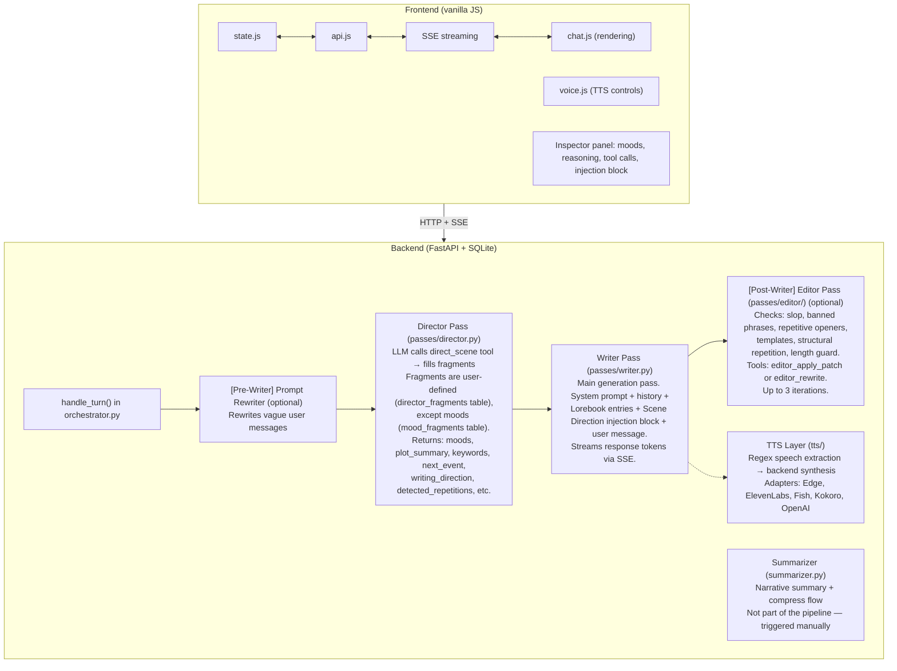
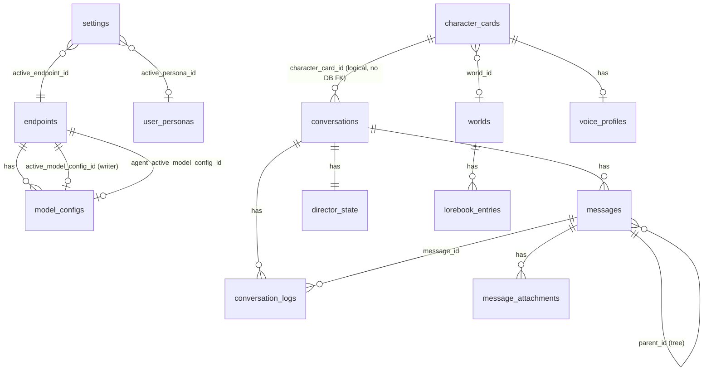
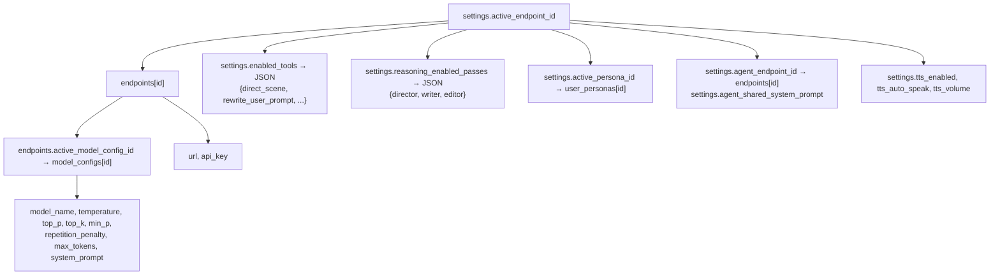
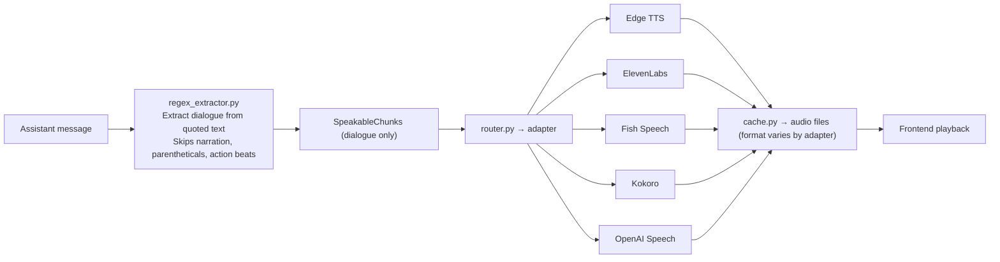

# AGENTS.md — Orb Codebase Guide

> **This is a living document.** Keep it up to date as the codebase evolves. When architectural decisions are made — new pipeline passes, DB schema changes, API additions, shifts in conventions — update the relevant sections here. An outdated AGENTS.md is worse than no AGENTS.md.

## Project Overview

Orb is an **agentic AI roleplay/writing frontend** with a Python/FastAPI backend and a vanilla JS frontend. It orchestrates multi-pass LLM pipelines (Director → Writer → Editor) with tool-calling agents that control scene direction, rewrite prompts, and audit output quality. Characters are imported as PNG cards (V2 spec). Conversations support branching (message tree with parent_id), lorebooks, mood/director fragments, and user personas.

**Stack:** Python 3.9+, FastAPI, aiosqlite, vanilla JS (no framework), SQLite DB, uvicorn

## Architecture



### Pipeline Context Flow

```mermaid
flowchart LR
    load["_load_pipeline_context()"] --> prefixes["_build_prefixes()"]
    prefixes --> writer_prefix["Writer prefix via _build_prefix_from_ctx()"]
    prefixes --> agent_prefix["Agent prefix (separate endpoint/config)"]
    lorebook["Lorebook injection via _compute_lorebook()<br/>computed separately from prefixes"]
    writer_prefix --> pipeline["_run_pipeline()"]
    agent_prefix --> pipeline
    lorebook --> pipeline
    pipeline --> style["Style injection computed inside _run_pipeline()<br/>via compute_style_injection_block()"]
    pipeline --> writer["_writer_pass() receives prefix + inj_block + lorebook_block"]
```

## Directory Structure

```
Orb/
├── backend/
│   ├── main.py              # FastAPI app: all API routes, Pydantic models
│   ├── orchestrator.py      # Pipeline orchestration: handle_turn, _run_pipeline
│   ├── database/            # DB package (aiosqlite). __init__.py re-exports the
│   │                        # full public API for backwards-compatible imports.
│   │   ├── connection.py    # DB_PATH, get_db() async context manager, _build_set_clause
│   │   ├── schema.py        # CREATE TABLES script
│   │   ├── seeds.py         # SEED_* / DEFAULT_* constants
│   │   ├── bootstrap.py     # init_db() (schema + inline ALTERs + seed inserts), reset_to_defaults()
│   │   ├── queries/         # Per-domain CRUD modules (one file per table group)
│   │   └── migrations/      # DB migrations scripts + run_pending() runner
│   ├── llm_client.py        # LLM API client (OpenAI-compatible), streaming, reasoning
│   ├── prompt_builder.py    # System prompt assembly, style injection, lorebook injection
│   ├── tool_defs.py         # Tool schemas (direct_scene, rewrite, editor tools), constants
│   ├── endpoint_profiles.py # Per-provider quirks (url patterns, body transforms)
│   ├── tavern_cards.py      # PNG card import (tEXt chunk extraction, V2 spec parsing)
│   ├── summarizer.py        # Narrative summary generation + compress flow
│   ├── macros.py            # Macro resolution ({{user}}, {{char}}, {{roll}}, etc.)
│   ├── kv_tracker.py        # Debug: logs messages/tools to JSON for inspection
│   ├── utils.py             # Shared utilities
│   ├── passes/
│   │   ├── director.py      # Director pass: LLM calls direct_scene tool
│   │   ├── writer.py        # Writer pass: main streaming generation
│   │   └── editor/
│   │       ├── editor.py    # Editor orchestrator: audit → patch/rewrite loop
│   │       ├── audit.py     # Phrase bank matching, opener/template detection
│   │       ├── slop_detector.py       # Regex-based banned phrase detection
│   │       ├── opening_monotony.py    # Repetitive sentence opener detection
│   │       ├── template_repetition.py # Part-of-speech pattern repetition
│   │       ├── structural_repetition.py # Same paragraph layout as previous msgs
│   │       └── contrastive_negation.py # "not X, but Y" cliché detection
│   ├── tts/
│   │   ├── base.py          # TTSAdapter abstract base class
│   │   ├── router.py        # Adapter registry, routes backend name → adapter class
│   │   ├── cache.py         # Audio file cache keyed by text + voice params
│   │   ├── regex_extractor.py # Speech/non-speech chunk splitting
│   │   ├── edge_adapter.py      # Edge TTS (free, local)
│   │   ├── elevenlabs_adapter.py # ElevenLabs API
│   │   ├── fish_adapter.py      # Fish Speech API
│   │   ├── kokoro_adapter.py    # Kokoro TTS (local)
│   │   └── openai_speech_adapter.py # OpenAI Speech API
│   └── data/                # Runtime: app.db (SQLite), tts_cache/
├── frontend/
│   ├── index.html           # Single-page app shell
│   ├── app.js               # Bootstrap: wire up sidebar, tabs, modals
│   ├── state.js             # Global state object (S.*), reactive getters
│   ├── api.js               # All fetch() calls to backend
│   ├── chat.js              # Chat rendering, message display, Inspector, streaming
│   ├── voice.js             # TTS UI controls, speak buttons, voice settings
│   ├── library.js           # Character card grid/list, CRUD UI
│   ├── settings.js          # Settings panel, endpoint/model config UI
│   ├── lorebooks.js         # World/lorebook entry management
│   ├── modal.js             # Generic modal utilities
│   ├── mobile.js            # Mobile-specific handlers
│   ├── utils.js             # $() helper, esc(), debounce, etc.
│   ├── validate.js          # Input validation helpers
│   ├── tabLock.js           # Browser tab visibility lock
│   ├── style.css            # Main stylesheet
│   ├── mobile.css           # Mobile breakpoints
│   ├── fonts.css            # Custom font declarations
│   ├── fonts/               # Self-hosted: Crimson, Exo2, Lora, Playfair, Spectral, Fira Code
│   └── themes/              # 9 CSS theme files
├── docs/
│   └── tts.md               # TTS setup guide, backend config, adding new backends
├── tests/
│   ├── unit/                # Unit tests (editor, fragments, TTS adapters, etc.)
│   └── integration/         # Integration tests (FastAPI TestClient)
├── scripts/
│   ├── tests.sh             # Run test suites
│   ├── format_backend.sh    # Black formatting
│   ├── format_frontend.sh   # Biome formatting
│   ├── lint.sh              # Linting
│   ├── compatibility_test.sh # Version compat checks
│   ├── security_check.sh   # Security scan
│   └── dump_diagnostic.py   # DB state dump for debugging
├── requirements.txt
├── requirements-dev.txt
├── package.json           # Node deps (Lefthook, Biome)
├── biome.json             # Frontend formatter/linter config
├── pytest.ini             # Pytest configuration
├── lefthook.yml           # Git hooks (auto-format on commit)
├── run_unix.sh            # Start backend (Unix)
├── run_windows.bat        # Start backend (Windows)
├── CONTRIBUTING.md
└── README.md
```

## Database Schema

### Core Tables

| Table | Purpose | Key Columns |
|-------|---------|-------------|
| `settings` | Global singleton config (id=1) | endpoint_url, model_name, enabled_tools (JSON), length_guard_*, reasoning_enabled_passes, active_persona_id, active_endpoint_id, tts_*, agent_* |
| `endpoints` | LLM API endpoints | url, api_key, active_model_config_id, agent_active_model_config_id → model_configs.id |
| `model_configs` | Per-endpoint model settings | endpoint_id, model_name, temperature, top_p, top_k, min_p, repetition_penalty, max_tokens, system_prompt, role |
| `conversations` | Chat sessions | character_card_id, character_name, character_scenario, post_history_instructions, active_leaf_id → messages.id |
| `messages` | All messages (tree branching via parent_id) | conversation_id, role (user/assistant), content, turn_index, parent_id → messages.id, progressive_fields (JSON), created_at |
| `character_cards` | Imported/created characters (V2 spec) | name, description, personality, scenario, first_mes, mes_example, system_prompt, avatar_b64, world_id |
| `user_personas` | User profiles injected into system prompt | name, description, avatar_color |

### Agent/Auditor Tables

| Table | Purpose | Key Columns |
|-------|---------|-------------|
| `director_state` | Per-conversation Director memory | conversation_id (PK), active_moods (JSON), keywords (JSON), progressive_fields (JSON) |
| `director_fragments` | Dynamic Director parameters | id, label, description, field_type, required, enabled, injection_label, sort_order |
| `mood_fragments` | Named mood presets | id, label, description, prompt_text, negative_prompt, enabled |
| `phrase_bank` | Banned phrases for editor audit | id, variants (JSON array of strings) |
| `conversation_logs` | Per-turn Director audit trail | conversation_id, turn_index, message_id, agent_raw_output, tool_calls (JSON), active_moods_after, progressive_fields_after (JSON), injection_block, agent_latency_ms |

### TTS Tables

| Table | Purpose | Key Columns |
|-------|---------|-------------|
| `voice_profiles` | Per-character TTS settings | character_card_id (unique), backend, voice_id, language, rate, pitch, enabled, endpoint_id, api_url, api_key, model |

### World/Lorebook Tables

| Table | Purpose | Key Columns |
|-------|---------|-------------|
| `worlds` | Lorebook containers | name, enabled |
| `lorebook_entries` | Keyword-triggered context injections | world_id, name, content, keywords (JSON), case_insensitive, priority, enabled |

### Supporting Tables

| Table | Purpose |
|-------|---------|
| `message_attachments` | Images attached to messages (mime_type, data_b64) |

### Relationships



## API Endpoints

### Settings & Config
- `GET /api/settings` / `PUT /api/settings` — Global settings singleton
- `GET /api/endpoints` / `POST /api/endpoints` — List/create endpoints
- `GET/PUT/DELETE /api/endpoints/{id}` — CRUD single endpoint
- `GET/POST /api/endpoints/{id}/models` — List/create model configs
- `PUT/DELETE /api/models/{id}` — Update/delete model config

### Conversations
- `GET /api/conversations` / `POST /api/conversations` — List/create
- `PUT/DELETE /api/conversations/{cid}` — Update/delete
- `POST /api/conversations/{cid}/touch` — Update timestamp
- `POST /api/conversations/{cid}/summarize` — SSE stream narrative summary
- `POST /api/conversations/{cid}/compress` — Create compressed continuation
- `POST /api/conversations/{cid}/stop` — Abort generation
- `GET /api/conversations/{cid}/context-size` — Estimated context token count

### Messages
- `GET /api/conversations/{cid}/messages` — Active message path with branch navigation metadata (branch_count, branch_index, prev/next branch IDs)
- `POST /api/conversations/{cid}/send` — Send message (SSE stream response)
- `POST /api/conversations/{cid}/continue` — Regenerate from last user msg
- `POST .../messages/{id}/edit` — Edit message content
- `DELETE .../messages/{id}` — Delete message, its siblings, and all descendants
- `POST .../messages/{id}/switch-branch` — Switch active branch
- `POST .../messages/{id}/regenerate` — Regenerate single response
- `POST .../messages/{id}/super_regenerate` — Regenerate keeping prior as context
- `POST .../messages/{id}/magic_rewrite` — Rewrite with custom instruction

### Characters
- `GET /api/characters` / `POST /api/characters` — List/create
- `POST /api/characters/import` — Import from PNG (multipart upload)
- `GET/PUT/DELETE /api/characters/{id}` — CRUD
- `GET /api/characters/{id}/avatar` — Serve avatar image
- `GET /api/characters/{id}/export` — Export as PNG card

### TTS & Voice
- `GET /api/tts/backends` — List available TTS backends
- `GET /api/tts/voices` — List voices for a backend
- `GET /api/tts/models` — List models for a backend
- `POST /api/tts/preview` — Preview TTS output
- `GET/PUT /api/characters/{id}/voice-profile` — Per-character voice settings
- `POST /api/conversations/{cid}/messages/{id}/speak` — Generate speech for message

### Fragments & Moods
- `GET/POST /api/fragments` — List/create mood fragments
- `PUT/DELETE /api/fragments/{fid}` — Update/delete mood fragment
- `GET/POST /api/director-fragments` — List/create director fragments
- `PUT/DELETE /api/director-fragments/{fid}` — Update/delete director fragment

### Worlds & Lorebooks
- `GET/POST/PUT/DELETE /api/worlds` — Worlds CRUD
- `GET/POST /api/worlds/{id}/entries` — List/create lorebook entries
- `GET/PUT/DELETE /api/worlds/{id}/entries/{entry_id}` — CRUD single entry
- `POST /api/worlds/{id}/import` — Import lorebook (standalone JSON or Tavern V2 character_book.entries)
- `GET /api/lorebook-entries/active` — All enabled entries from enabled worlds

### Phrase Bank
- `GET /api/phrase-bank` / `POST /api/phrase-bank` — List/create
- `PUT/DELETE /api/phrase-bank/{id}` — Update/delete

### Personas
- `GET/POST /api/user-personas` — List/create
- `PUT/DELETE /api/user-personas/{id}` — Update/delete

### Inspector
- `GET /api/conversations/{cid}/director` — Director state
- `GET /api/conversations/{cid}/logs` — Conversation logs
- `GET /api/conversations/{cid}/messages/{id}/director-log` — Per-message Director log

### Other
- `GET /` — Serve frontend (SPA shell)
- `GET /api/themes` — Available CSS themes
- `POST /api/reset` — Factory reset (confirm required)

## Configuration Chain



Multiple model configs per endpoint. Active one selected via `endpoints.active_model_config_id`. Agent (Director) can use a separate endpoint (`agent_endpoint_id`) or share the writer's.

## Frontend Architecture

- **State** (`state.js`): Single global `S` object. No reactive framework — components call `render*()` functions after state mutations.
- **Rendering** (`chat.js`): `renderMessages()` rebuilds the entire message list from `S.messages`. Inspector panel rendered by `renderInspector()`.
- **Streaming**: SSE events parsed in `chat.js` — `director_start`, `director_done`, `prompt_rewritten`, `token`, `reasoning`, `writer_rewrite`, `editor_done`, `user_message_created`, `done`, `error`. `_result` and `_refined_result` are backend-internal, consumed before reaching the frontend. Tokens accumulate into the current message div in real-time.
- **API** (`api.js`): All backend calls via `fetch()`. SSE streams handled by `EventSource`-like parsing in `chat.js`.
- **Voice** (`voice.js`): TTS controls — speak buttons on messages, voice settings, TTS status bar.
- **Branching**: Messages use `parent_id` forming a tree. `conversations.active_leaf_id` selects the visible leaf. UI shows branch count/index with prev/next navigation buttons.

## TTS Pipeline



Each character card has a voice profile (`voice_profiles` table) selecting backend, voice ID, language, rate, pitch. The regex extractor splits text into dialogue and narration chunks; only dialogue is spoken by default.

## Context Management

Orb sends the **full active message path** (leaf to root) every turn — no automatic truncation or rolling window. Inactive sibling branches are not included.

- `updateContextCounter()` calls `GET /api/conversations/{cid}/context-size` which computes a per-component token breakdown (system prompt, persona, scenario, messages, director injection, lorebook, post-history) using `chars / 3.5` per component
- **Manual compress flow**: `POST /summarize` → LLM writes narrative summary → user reviews → `POST /compress` → creates new conversation with summary + last N messages
- No RAG, no background compaction, no automatic summarization

## Testing

- **Unit tests** (`tests/unit/`): Test individual functions — editor audit, fragment parsing, dialogue splitting, template detection, abort logic, TTS adapters, regex extractor.
- **Integration tests** (`tests/integration/`): FastAPI `TestClient` against real DB — CRUD for characters, conversations, endpoints, settings, fragments, personas, TTS, context size.
- **Run**: `cd ~/repos/Orb && python -m pytest tests/ -v`
- **No e2e tests** for the frontend.

### Codex Sandbox Caveat

When running under Codex's filesystem/network sandbox, `aiosqlite` integration tests can hang before the first test body runs. The sandbox stalls `sqlite3.connect()` when it is executed from `aiosqlite`'s worker thread. This is a Codex execution-environment limitation, not an Orb database bug.

- Unit tests that do not initialize the async DB can run normally in the sandbox.
- Integration tests, app startup checks, and any command calling `init_db()` from the `backend.database` package should be run with Codex escalated execution (`sandbox_permissions: "require_escalated"`).

## Common Development Workflows

### Adding a New Pipeline Pass

1. Create `backend/passes/your_pass.py` — follow the pattern of `director.py` or `writer.py`
2. Add tool schemas to `tool_defs.py` if the pass uses tool calling
3. Integrate into `_run_pipeline()` in `orchestrator.py`
4. Add SSE events for streaming output
5. Handle in frontend `chat.js` event parser

### Adding a New Tool

1. Define the tool schema in `tool_defs.py` (OpenAI function-calling format)
2. Register in `TOOLS` dict with `choice` and `schema` entries
3. Add to `PRE_WRITER_TOOLS` or `POST_WRITER_TOOLS` sets
4. Handle the tool call response in the relevant pass
5. Add toggle in `settings.enabled_tools` and frontend tools panel

### Adding a New TTS Backend

1. Create `backend/tts/your_backend.py` extending `TTSAdapter` from `base.py`
2. Implement `list_voices()`, `synthesize()`, and any backend-specific methods
3. Register in `router.py` — import and add to `_REGISTRY` dict
4. Add any new dependencies to `requirements.txt` (optional, graceful import)

### Adding a New UI Panel

1. Add HTML structure to `index.html`
2. Add toggle button with `onclick` handler
3. Create `renderYourPanel()` function in the relevant JS file
4. Wire into state updates (call `renderYourPanel()` after mutations)

### Adding a New Theme

1. Create `frontend/themes/your_theme.css`
2. Follow the pattern of existing themes — CSS custom properties on `[data-theme="your_theme"]`
3. The theme is automatically listed via `GET /api/themes`

## Gotchas and Pitfalls

1. **Message tree branching** — Messages use `parent_id` to form a tree. `conversations.active_leaf_id` marks the visible leaf. The API returns branch navigation metadata (branch_count, branch_index, prev/next IDs). Deleting a message cascades to all descendants.

2. **Streaming lifecycle** — SSE connections must be properly cleaned up. The `_CleanupStreamingResponse` wrapper handles client disconnects. The `stop` endpoint sets an abort flag checked between pipeline stages. The abort logic is complex (aborting mid-writer stream must also save partial output to DB) and may need an audit.

3. **Tool call parsing** — The Director pass parses JSON tool call arguments. Malformed JSON from the LLM can crash the pipeline. Error handling wraps these in try/except but edge cases exist.

4. **SQLite + aiosqlite** — All DB operations are async via aiosqlite. No ORM — raw SQL inside `backend/database/queries/`, one module per table group. The package's `__init__.py` re-exports every public function so callers can keep importing from `backend.database` directly. Migrations run sequentially by number prefix.

5. **Endpoint profiles** — Middleware layer to handle unsupported params where the provider returns an error instead of ignoring them. Not every provider needs its own profile — only add one when a provider's API quirks require body transformation.

6. **Reasoning models** — Some models emit `reasoning_content` before `content`. The streaming handler separates these. `reasoning_enabled_passes` in settings controls which pipeline passes get reasoning enabled.

7. **Migrations are sequential** — New migrations must use the next number in sequence. They run at app startup via `run_pending()` in `backend/database/migrations/__init__.py`. The runner imports each migration module via `importlib.import_module(f"backend.database.migrations.{name}")` — keep that path in sync if the package ever moves again.

8. **Patching `DB_PATH` in tests** — The canonical `DB_PATH` lives in `backend/database/connection.py`. Tests must patch `backend.database.connection.DB_PATH` (which is what `get_db()` reads). Patching the package re-export `backend.database.DB_PATH` will *not* reach the connection module. See `tests/integration/conftest.py` for the working pattern.

9. **Phrase bank format** — `phrase_bank.variants` is a JSON array of strings. The editor audit matches these against response text using case-insensitive regex.

10. **Lorebook scan depth** — Hard-coded to 6 messages (`LOREBOOK_SCAN_DEPTH` in `prompt_builder.py`). Only the last 6 messages are scanned for lorebook keyword matches.

11. **TTS regex extractor** — Splits text into speech/non-speech chunks using quotation marks. The `regex_extractor.py` handles edge cases (nested quotes, em-dashes) but isn't perfect for all writing styles. Only speech chunks are sent to the TTS backend.

12. **Agent endpoint separation** — Both the Director and Editor can use separate endpoints from the Writer (`agent_endpoint_id` in settings). If `agent_same_as_writer` is true, they share. When using a separate endpoint, note that a different prompt caching mechanism applies, and the instruction prompt has a small difference. Make sure to check which endpoint you're targeting when modifying agent-related code.

13. **Macros resolve at different levels** — `resolve_message()` expands everything ({{user}}, {{char}}, inline macros like {{roll}}). `resolve_prompt()` only does {{user}}/{{char}} substitution. Use `resolve_prompt()` for historical messages where inline macros shouldn't fire.
