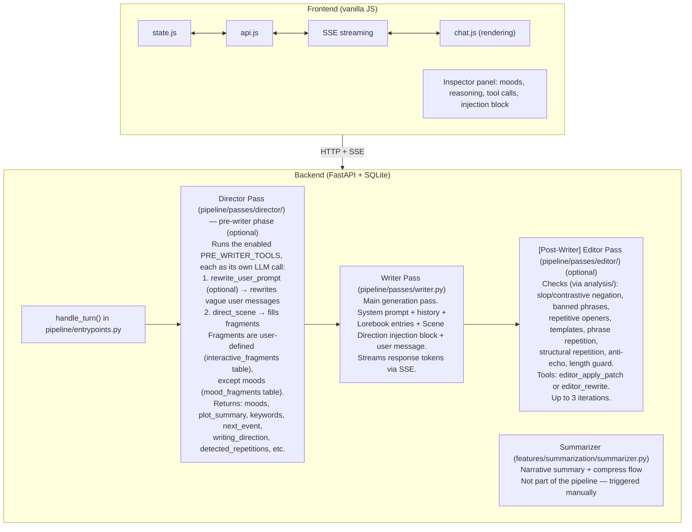
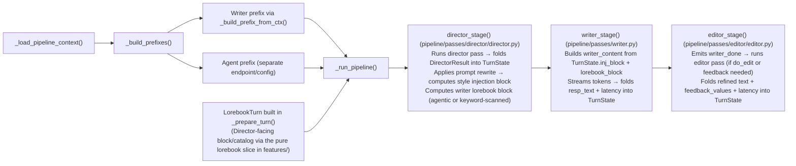
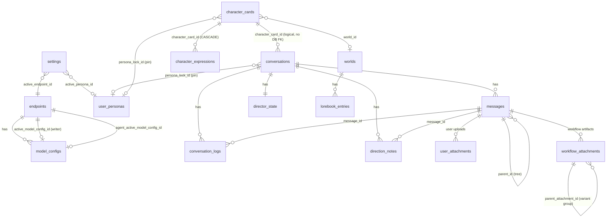
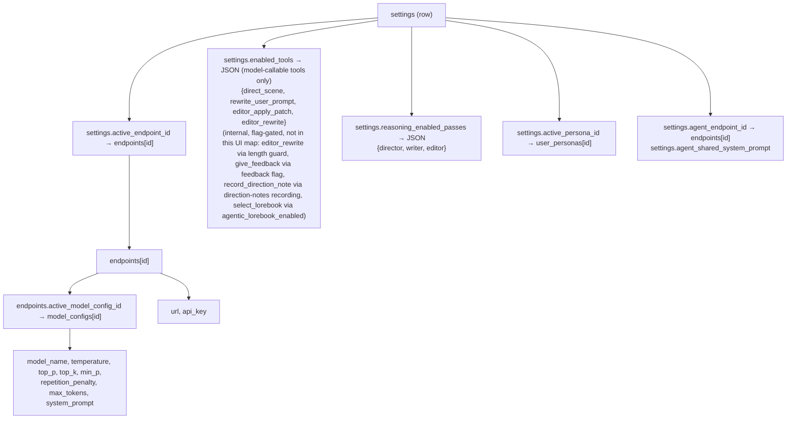

# AGENTS.md — Orb Codebase Guide

> **Keep this guide current.** When the architecture changes — new pipeline passes, DB schema changes, API additions, shifts in convention — update the relevant section here so it stays the single source of truth.

## Project Overview

Orb is an **agentic AI roleplay/writing frontend** with a Python/FastAPI backend and a vanilla JS frontend. It orchestrates multi-pass LLM pipelines (Director → Writer → Editor) with tool-calling agents that control scene direction, rewrite prompts, and audit output quality. Characters are imported as PNG cards (V2 spec). Conversations support branching (message tree with parent_id), lorebooks, mood/interactive fragments, and user personas.

**Stack:** Python 3.9+, FastAPI, aiosqlite, vanilla JS (no framework), SQLite DB, uvicorn

## Architecture

> **Cross-pass prompt caching:** The director/writer/editor passes are deliberately built to share one KV-cached prefix (same system prompt, same history, same tool schemas) so each turn stays fast and cheap. The full design — the invariants, dual-model behavior, the editor's ReAct loop, and the KV tracker — lives in [docs/architecture/kv-cache.md](docs/architecture/kv-cache.md). Read it before touching anything that builds prompts, orders passes, or assembles tool schemas, and keep cache details there rather than duplicating them here.

> **Secondary workflows:** Pluggable workflows hook into the turn pipeline (pre/post), emit on-demand HTTP responses, and persist per-message artifacts — registered in `backend/workflows/` with frontend modules in `frontend/workflows/`. The full framework reference (registration, hook contexts, locks, the toolkit import surface, attachment cache, HTTP routes, and the frontend state surface), along with the shipped workflows, lives in [docs/architecture/secondary-workflow.md](docs/architecture/secondary-workflow.md). Start from that doc rather than re-deriving the framework here.



### Pipeline Context Flow



## Directory Structure

```
Orb/
├── backend/
│   ├── main.py              # THIN entry point: `from .api import build_app; app = build_app()`
│   │                        # + uvicorn __main__ guard. `backend.main:app` is the ASGI app object.
│   ├── api/                 # HTTP LAYER (top of the stack) — all HTTP routes + app wiring
│   │   ├── __init__.py      # build_app(): FastAPI app factory — lifespan (DB init, migrations,
│   │   │                    # schema check), no_cache middleware, auto-include routers, /static mount LAST
│   │   ├── deps.py          # ALL cross-route shared state/helpers: _active_aborts, the
│   │   │                    # _workflow_root_lock/_conversation_stream_lock helpers + backing
│   │   │                    # registries, _CleanupStreamingResponse/_sse_stream/_safe_aclose,
│   │   │                    # require_world/require_lorebook_entry Depends, validators, FRONTEND_DIR
│   │   ├── schemas.py       # Pydantic request/response models (SettingsUpdate, etc.)
│   │   └── routes/          # One APIRouter per domain; build_app() includes routes.ROUTERS in order
│   │       ├── __init__.py  # ROUTERS list (defines router include order); add a domain = drop a file
│   │       ├── settings.py  endpoints.py  conversations.py  messages.py
│   │       ├── characters.py  fragments.py  worlds.py  phrase_bank.py
│   │       └── personas.py  presets.py  workflows.py  stats.py  misc.py
│   ├── pipeline/            # PIPELINE LAYER — the Director→Writer→Editor turn engine.
│   │   │                    # The turn lifecycle is split into single-purpose modules
│   │   │                    # (deps run strictly downward, predicates is the leaf):
│   │   │                    #   entrypoints → {context, orchestrator, persistence, config}
│   │   │                    #   context/orchestrator → workflow_bridge → {workflows,…}
│   │   │                    #   {config, context, persistence} → predicates / state
│   │   ├── __init__.py      # Facade: handle_turn, handle_regenerate, handle_fork_edit,
│   │   │                    # handle_super_regenerate, handle_magic_rewrite (from entrypoints);
│   │   │                    # resolve_persona_id, agent_enabled (from predicates);
│   │   │                    # TurnState/ModelLane/_PipelineConfig (from state)
│   │   ├── entrypoints.py   # TOP INTEGRATOR (pipeline's mirror of api/): the 5 public
│   │   │                    # handle_* + _generate_reply driver (setup→pipeline→persist)
│   │   │                    # + regen helpers (_resolve_target_and_parent/_prepare_regen_context)
│   │   ├── orchestrator.py  # The three-pass coordinator: _run_pipeline (director→writer→
│   │   │                    # editor + POST_PIPELINE hooks + direction-note steps) + _make_result (TurnState → _result)
│   │   ├── context.py       # Inbound: PipelineContext + _load_pipeline_context (builds the
│   │   │                    # LLM clients — tests patch context.LLMClient), _build_prefix(es),
│   │   │                    # the LorebookTurn (via the pure lorebook slice in features/), _TurnSetup +
│   │   │                    # _prepare_turn (pre-pipeline setup)
│   │   ├── config.py        # Per-turn resolution: _resolve_pipeline_config (lanes + flags),
│   │   │                    # _build_writer_tools_blob, _split_interactive_fragments
│   │   ├── persistence.py   # Outbound: _consume_pipeline + _persist_*/_fallback_*/_shielded_*
│   │   │                    # + _conversation_log_writer
│   │   ├── workflow_bridge.py # The pipeline↔workflows seam: _iterate_pre_pipeline_hooks +
│   │   │                    # _run_post_pipeline + _stage_workflow_attachment + _PostPipelineResult
│   │   ├── predicates.py    # Dependency-free leaf (the package's core/): agent_enabled,
│   │   │                    # is_dual_model, resolve_persona_id, direction_note_* gates
│   │   ├── state.py         # Per-turn contract dataclasses:
│   │   │                    # ModelLane, _PipelineConfig, TurnState (mutable per-turn bag
│   │   │                    # threaded through stages), LorebookTurn (lorebook inputs threaded
│   │   │                    # _prepare_turn → director_stage; wraps the lorebook slice (features/lorebook/)).
│   │   │                    # Passes import here.
│   │   └── passes/
│   │       ├── director/    # Director pass package
│   │       │   ├── __init__.py  # Re-exports: DirectorResult, director_pass, director_stage,
│   │       │   │                # apply_tool_calls, build_direct_scene_override, DirectionNoteResult,
│   │       │   │                # direction_note_step, extract_direction_notes, lorebook_select_step
│   │       │   ├── director.py  # director_pass (raw LLM loop) + director_stage (full stage:
│   │       │   │                # pass + rewrite + style injection + lorebook + direction-notes block)
│   │       │   ├── direction_note.py # record_direction_note step: persists Director notes across a branch (pre-writer/post-turn)
│   │       │   ├── lorebook_select.py # select_lorebook step: agentic lorebook pick (own forced call, decoupled from direct_scene)
│   │       │   └── prompt_rewrite.py # apply_rewrite, order_director_tools, suppresses_reasoning
│   │       ├── writer.py    # writer_pass (raw LLM loop) + writer_stage (builds
│   │       │                # writer_content, streams tokens, folds latency into TurnState)
│   │       └── editor/      # editor_pass + editor_stage + feedback + length_guard
│   │           ├── __init__.py  # Re-exports: editor_pass, editor_stage, _feedback_active,
│   │           │                # build_feedback_override, FeedbackResult, feedback_step
│   │           ├── editor.py    # editor_pass (raw edit loop) + editor_stage (gating +
│   │           │                # writer_done boundary + event translation)
│   │           ├── feedback.py     # give_feedback post-writer step
│   │           └── length_guard.py # length-guard feature
│   ├── features/            # FEATURE SLICES — each feature its own self-contained folder
│   │   │                    # (facade __init__.py; imports only downward; never another slice)
│   │   ├── cards/           # parsing.py (PNG tEXt/V2 parse) +
│   │   │                    # downloader.py (external card fetch)
│   │   ├── summarization/   # summarizer.py — narrative summary + compress flow
│   │   ├── presets/         # engine.py: selective export, merge-import,
│   │   │                    # full snapshots/restore (ATTACH + VACUUM INTO). Schema-driven;
│   │   │                    # policy declared in database/preset_schema.py
│   │   └── lorebook/        # PURE lorebook activation — a slice
│   │                        # importing only core: selection (constant / keyword scan /
│   │                        # Director pick) + render. Consumed by the director stage (via
│   │                        # LorebookTurn in pipeline/state.py) and the context-size route,
│   │                        # both above it. __init__.py facade; activation.py the pipeline.
│   ├── analysis/            # ANALYSIS LAYER (shared, pure) — prose-quality detection;
│   │   │                    # deps: database.models + stdlib only. Shared by editor pass + workflows.
│   │   ├── __init__.py      # Facade: run_audit, format_report, AuditReport, AUDIT_TYPES + result types
│   │   ├── audit.py         # Consolidated runner: run_audit() runs the enabled detectors →
│   │   │                    # AuditReport, format_report() renders it; AUDIT_TYPES toggle map
│   │   ├── format_consistency.py # Deterministic RP-markup normalizer — NOT a detector but a
│   │   │                    # transformer (returns rewritten text, not findings): holds a draft's
│   │   │                    # quote/asterisk convention to recent messages. Pure; the
│   │   │                    # format_consistency workflow calls it via the toolkit. Peer of the
│   │   │                    # detector suite (intentionally flat, not inside detectors/).
│   │   ├── text/            # FOUNDATION sub-layer — pure text primitives, no intra-analysis deps;
│   │   │                    # used by every detector, format_consistency, and the facade:
│   │   │                    #   lexical.py — tokenize/normalize, n-grams, token-sequence compare,
│   │   │                    #     stopwords + content-word floor
│   │   │                    #   text_segmentation.py — paragraph/sentence/dialogue split + block extraction
│   │   └── detectors/       # Flag-only scanners (read text → findings): slop_detector,
│   │                        # contrastive_negation, opening_monotony, phrase_repetition,
│   │                        # structural_repetition, template_repetition, anti_echo (user→assistant echo)
│   ├── inference/           # INFERENCE LAYER — LLM transport + prompt/tool assembly; deps: core
│   │   ├── __init__.py      # Facade re-export
│   │   ├── client.py        # LLM API client: chat (OpenAI-compat) + text (llama.cpp native) transports, streaming, reasoning
│   │   ├── text_completion.py # Text-mode pure helpers (think-splitter, /props tag sniff, param remap, usage synth) — a LEAF here
│   │   ├── endpoint_profiles.py # Per-provider quirks (url patterns, body transforms) — a LEAF here
│   │   ├── cached_call.py   # Core cached-call path: CachedBase (byte-identical
│   │   │                    # prefix+tools+model base every pass extends) + cached_complete
│   │   ├── kv_tracker.py    # Debug KV-cache tracker: logs messages/tools to JSON for inspection
│   │   ├── prompt_builder.py # System prompt assembly, style injection (positions the
│   │   │                    # lorebook catalog string; block computation lives in features/lorebook/)
│   │   ├── tool_registry.py # Tool schemas (direct_scene, rewrite, editor tools), constants
│   │   └── local_ml.py      # Opt-in in-process CPU local-ML scaffold (MODELS registry,
│   │                        # hf download, per-feature Llama). Three features: input autocomplete
│   │                        # (/api/conversations/{cid}/autocomplete), slop scorer, and the
│   │                        # go-emotions expression classifier (aclassify → character expressions);
│   │                        # all via /api/local-ml/* routes. lazy-imports llama_cpp/huggingface_hub
│   │                        # so base Orb needs no ML deps
│   ├── core/               # SHARED KERNEL (bottom) — dependency-free leaves; imports nothing upward
│   │   ├── __init__.py      # Re-exports the kernel surface
│   │   ├── llm_types.py     # Wire contracts (ChatMessage, ToolCall, ContentPart, …)
│   │   ├── macros.py        # Macro resolution ({{user}}, {{char}}, {{roll}}, etc.) — dependency-free leaf
│   │   ├── locks.py         # Process-level asyncio locks (workflow_state / character_state / config / maintenance)
│   │   └── utils.py         # estimate_tokens, scrub_log, build_multimodal_content, extract_hyperparams
│   ├── database/            # FOUNDATION — DB package (aiosqlite); may read core, never imports up.
│   │   │                    # __init__.py re-exports the full public API for backwards-compatible imports.
│   │   ├── models.py        # Model layer: TypedDict row contracts + PhraseGroup;
│   │   │                    # depends on nothing else (see Data Contracts below)
│   │   ├── connection.py    # DB_PATH, get_db() async context manager, _build_set_clause
│   │   ├── schema.py        # CREATE TABLES script
│   │   ├── preset_schema.py # Preset engine product/security policy (single source of
│   │   │                    # truth): DOMAIN_ROOTS, EXCLUDED/SECRET/PRESERVED cols
│   │   ├── seeds.py         # SEED_* / DEFAULT_* constants
│   │   ├── bootstrap.py     # init_db() (schema + inline ALTERs + seed inserts), reset_to_defaults()
│   │   ├── queries/         # Per-domain CRUD modules (one file per table group)
│   │   └── migrations/      # DB migrations scripts + run_pending() runner
│   ├── workflows/           # Secondary workflow framework + shipped workflows
│   │   │                    # (see docs/architecture/secondary-workflow.md)
│   │   ├── __init__.py      # Registration site: register_workflow + subscribe + finalize_registry
│   │   ├── registry.py      # Workflow dataclass, subscriptions, state-store wrappers
│   │   ├── contracts.py     # HookType enum + per-hook Ctx dataclasses, ToolSpec
│   │   ├── toolkit.py       # Stable author import surface (LLM, prompts, DB readers, state, locks)
│   │   ├── _forced_call.py  # forced_tool_call(): one-shot single-tool forced LLM call
│   │   ├── attachment_cache.py # Byte-budget LRU-3 artifact cache (insert/rehydrate/evict/siblings)
│   │   ├── format_consistency/ # Shipped format-consistency workflow (no artifacts, no tools)
│   │   │   ├── __init__.py  # Workflow(...) instance (config: enabled, default on)
│   │   │   └── hooks.py     # post_pipeline hook: gates on config, calls analysis/format_consistency
│   │   │                    # via the toolkit, yields draft_replaced on a rewrite
│   │   └── tts/             # Shipped TTS workflow
│   │       ├── __init__.py  # Workflow(...) instance
│   │       ├── hooks.py     # post_pipeline / on_demand / regenerate / reroll_gen hooks
│   │       ├── synth.py     # Synthesis driver
│   │       └── engine/      # Per-provider TTS adapters (edge, elevenlabs, fish, kokoro, openai)
│   └── data/                # Runtime: app.db (SQLite)
├── frontend/
│   ├── index.html           # Single-page app shell
│   ├── app.js               # Bootstrap: wire up sidebar, tabs, modals
│   ├── state.js             # Global state object (S.*), reactive getters
│   ├── api.js               # All fetch() calls to backend
│   ├── chat.js              # Chat rendering, message display, Inspector, streaming
│   ├── library.js           # Character card grid/list, CRUD UI
│   ├── presets.js           # Presets/backups UI: export, import, apply, restore, snapshot library
│   ├── settings.js          # Settings panel, endpoint/model config UI
│   ├── lorebooks.js         # World/lorebook entry management
│   ├── direction_notes_panel.js # Direction Notes right-rail panel (list/add/edit/delete branch notes)
│   ├── panels.js            # Shared right-rail utility-panel slot (tools/inspector/notes, mutually exclusive)
│   ├── modal.js             # Generic modal utilities
│   ├── mobile.js            # Mobile-specific handlers
│   ├── utils.js             # $() helper, esc(), debounce, etc.
│   ├── validate.js          # Input validation helpers
│   ├── tabLock.js           # Browser tab visibility lock
│   ├── workflow_loader.js   # Boot loader: dynamic-imports each workflow's index.js
│   ├── workflow_segmentation.js     # .seg span wrapper enabling text effects / click handlers
│   ├── workflow_text_effects.js     # startTextEffect / clearTextEffect paint loop
│   ├── workflow_text_interaction.js # Click routing + multi-claimant chooser
│   ├── default_widget.js    # Fallback MIME-routed attachment renderer (image/audio/video)
│   ├── audio_player.js      # playAudio + channel controls (TTS playback)
│   ├── audio_schedule.js    # Pure audio scheduling math
│   ├── audio_transport.js   # Transport bar mount (channel selector + controls)
│   ├── style.css            # Main stylesheet
│   ├── mobile.css           # Mobile breakpoints
│   ├── fonts.css            # Custom font declarations
│   ├── fonts/               # Self-hosted: Crimson, Exo2, Lora, Playfair, Spectral, Fira Code
│   ├── themes/              # 9 CSS theme files
│   └── workflows/           # Frontend secondary workflow modules
│       ├── format_consistency/ # Shipped: index.js (one Tools-panel toggle for the normalizer)
│       └── tts/             # Shipped TTS frontend (index, widget, karaoke, config_panel, extract, tts.css)
├── docs/
│   ├── index.md             # Docs home / table of contents
│   ├── getting-started.md   # Install & first run
│   ├── contributing.md      # Contributor guide
│   ├── architecture/
│   │   ├── kv-cache.md      # How Orb reuses the LLM KV cache across passes & turns
│   │   └── secondary-workflow.md # Workflow framework dev guide
│   ├── features/            # Per-feature guides (director, feedback-fragments,
│   │                        # agentic-lorebook, anti-slop, length-guard, compress-history,
│   │                        # magic-rewrite, super-regenerate, persona-pinning,
│   │                        # homepage-stats, mobile, tts)
│   └── assets/              # Doc images
├── tests/
│   ├── unit/                # Unit tests (editor, fragments, etc.)
│   └── integration/         # Integration tests (FastAPI TestClient)
├── scripts/
│   ├── tests.sh             # Run test suites
│   ├── format_backend.sh    # Black formatting
│   ├── format_frontend.sh   # Biome formatting
│   ├── lint.sh              # Linting
│   ├── compatibility_test.sh # Version compat checks
│   ├── security_check.sh   # Security scan
│   └── dump_diagnostic.py   # DB state dump for debugging
├── requirements.txt
├── requirements-dev.txt
├── package.json           # Node deps (Lefthook, Biome)
├── biome.json             # Frontend formatter/linter config
├── pytest.ini             # Pytest configuration
├── lefthook.yml           # Git hooks (auto-format on commit)
├── run_unix.sh            # Start backend (Unix)
├── run_windows.bat        # Start backend (Windows)
├── CONTRIBUTING.md
└── README.md
```

## Architecture Layers

The backend is a **layered architecture with a shared kernel + vertical feature
slices**. Each package is a named layer (or an isolated feature slice) with the
same internal shape — a facade `__init__.py` re-exporting its public surface — and
dependencies run **strictly downward**:

```
api  →  {pipeline, features}  →  workflows  →  {inference, analysis}  →  core
                                                            ↘        ↘
                                                          database  →  core
```

- **`core/`** — the dependency-free leaf (everything may import it; it imports nothing upward).
- **`database/`** — a foundation that *may read* `core` (e.g. `queries/workflow_attachments.py` uses `core.utils.scrub_log`) and is read by every layer above, but **never imports up**.
- **`inference/`** — LLM transport + prompt/tool assembly; depends only on `core`.
- **`analysis/`** — pure prose-quality detection; depends only on `database.models` (+ stdlib). Sits below `workflows` and `pipeline`, parallel to `inference`. It exists so the auditor can be shared by both the editor pass *and* `workflows/toolkit` without a `workflows → pipeline` back-edge.
- **`workflows/`** — the plugin-registry gold standard; sits *below* `pipeline/` and *above* `inference`/`analysis`. `pipeline/workflow_bridge.py` imports it (the single pipeline↔workflows seam); it imports only `inference`, `analysis`, `core`, `database` — all downward.
- **`pipeline/`** — the Director→Writer→Editor turn engine + its per-turn contracts (`state.py`) + its passes.
- **`features/`** — vertical slices (`cards`, `summarization`, `presets`, `lorebook`), each self-contained. Most reach down into `inference`/`database`. **`lorebook/`** is the pure one: lorebook activation (selection — constant / keyword scan / Director pick — plus rendering) that imports only `core`. It is consumed by the director stage (via the `LorebookTurn` bundle in `pipeline/state.py`) and the context-size route, both of which sit above it.
- **`api/`** — the HTTP layer at the top; the only layer that wires everything together.

**The one-way rule:** a layer may import *downward* but never *up*, and never *sideways into a peer slice*. When a lower layer genuinely needs higher-layer *behavior* at a fixed seam, use **dependency inversion**: the lower layer declares a registration hook, and the higher layer registers an implementation at import. See `register_workflow_attachment_persister` in `database/queries/messages.py`, which `workflows/attachment_cache.py` fills in. Don't dodge the rule with a lazy `import backend.<higher layer>` inside a lower-layer function — that hides the inversion from the import graph without removing it. (The one sanctioned lazy-import exception is `database/bootstrap.py`'s `from ..features import presets`, which is documented and explicit.)

> **A passing `python -c "import backend.main"` does not prove the dependency graph is clean** — a back-edge only crashes if it forms a true import *cycle*. The one-way rule is a design invariant, not something the smoke test enforces; an `import-linter` contract would be the proper backstop.

### The bottom-up retarget rule

When relocating a module, move layers **bottom-up** (`core` → `inference`/`analysis` → `pipeline` → `features` → `api`) and **retarget every importer of the moved module in the same step** — even importers that will themselves move later. Each layer package sits at the `backend` top level exactly where the flat module used to, so a facade re-export changes only the *name* you import from (`from .llm_client` → `from .inference`) and leaves the relative-import dot count unchanged.

A module that both imports a lower layer *and* moves later is touched twice: once to **retarget the name** (when the lower layer moves) and once to **bump the dots** (when it moves deeper). Both edits are mechanical, and the gate after each step catches any miss: `import backend.main`, pyright at zero, `./scripts/tests.sh all`, and a `grep tests/` for stale paths.

One blast radius the facades do **not** cover: test imports of deep submodule paths, and `monkeypatch.setattr`/`mock.patch` **string** targets (e.g. `LLMClient` is patched in several namespaces). These fail at *runtime*, not at import, so update each string target when *its* module moves.

### The Standard Slice Shape (the symmetry contract)

Every `features/<name>/` slice follows one shape (mirroring `workflows/tts/`):

```
features/<name>/
├── __init__.py     # facade: re-export the slice's public callables
├── contracts.py    # (optional) slice-local dataclasses/TypedDicts; import only from core/ + database/models
├── <logic>.py      # pure logic, testable in isolation
└── <integration>.py# wiring that reads context, calls logic, persists via database/
```

A slice may import **downward** (`core`, `inference`, `analysis`, `database`) but
never from another slice, `pipeline/`, `workflows/`, or `api/`.

### Three ways to add a feature (without editing `orchestrator.py` or `main.py`)

1. **HTTP route** — drop `api/routes/<feature>.py` exposing `router = APIRouter()` and append it to `ROUTERS` in `api/routes/__init__.py`. `build_app()` includes it automatically; no edit to `main.py`.
2. **Pipeline-adjacent feature (the default)** — use the `workflows/` plugin path: a new folder plus one `register_workflow(...)`/`subscribe(...)` block in `workflows/__init__.py`. See [docs/architecture/secondary-workflow.md](docs/architecture/secondary-workflow.md).
3. **Self-contained domain feature** — a new `features/<name>/` slice (Standard Slice Shape) plus one router file. The only shared files it touches are additive (`database/schema.py` + a numbered migration when it needs persistence).

## Database Schema

### Core Tables

| Table | Purpose | Key Columns |
|-------|---------|-------------|
| `settings` | Global singleton config (id=1) | endpoint_url, model_name, enabled_tools (JSON — registered tools only), length_guard_* (enabled/enforce/max_words/max_paragraphs), agentic_lorebook_enabled, feedback_enabled, direction_notes_record, direction_notes_inject (`off`/`director`/`writer`/`both`), reasoning_enabled_passes, active_persona_id, active_endpoint_id, agent_*, workflow_config (JSON), generated_chars (lifetime LLM-output char counter; NULL = unseeded), attachment_cache_budget_bytes, attachment_access_counter |
| `endpoints` | LLM API endpoints | url, api_key, active_model_config_id, agent_active_model_config_id → model_configs.id, completion_mode (`chat`\|`text`; `text` = llama.cpp native transport, surfaced by the settings overlay as `completion_mode`/`agent_completion_mode` and threaded into every `LLMClient` ctor) |
| `model_configs` | Per-endpoint model settings | endpoint_id, model_name, temperature, top_p, top_k, min_p, repetition_penalty, max_tokens, system_prompt, role |
| `conversations` | Chat sessions | character_card_id, character_name, character_scenario, post_history_instructions, active_leaf_id → messages.id, persona_lock_id → user_personas.id, workflow_state (JSON) |
| `messages` | All messages (tree branching via parent_id) | conversation_id, role (user/assistant), content, turn_index, parent_id → messages.id, progressive_fields (JSON), created_at, workflow_state (JSON) |
| `character_cards` | Imported/created characters (V2 spec) | name, description, personality, scenario, first_mes, mes_example, system_prompt, avatar_b64, world_id, persona_lock_id → user_personas.id, workflow_state (JSON) |
| `character_expressions` | Per-character expression images (SillyTavern-style) | character_card_id → character_cards.id (CASCADE), label (go-emotions), data_b64, mime; PK (character_card_id, label) |
| `user_personas` | User profiles injected into system prompt | name, description, avatar_color |

### Agent/Auditor Tables

| Table | Purpose | Key Columns |
|-------|---------|-------------|
| `director_state` | Per-conversation Director memory | conversation_id (PK), active_moods (JSON), keywords (JSON), progressive_fields (JSON) |
| `interactive_fragments` | Dynamic Director parameters | id, label, description, field_type (`string`/`array`/`progressive`/`feedback`/`direction_note`), required, enabled, injection_label, sort_order, direction_note_timing (`pre_writer`/`post_turn`). A `feedback` fragment is surfaced to the user as a post-writer note via `give_feedback` instead of steering the Writer (gated by `settings.feedback_enabled`). A `direction_note` fragment records a lasting note via `record_direction_note` that persists across the branch (gated by `settings.direction_notes_record`); see the `direction_notes` table. |
| `mood_fragments` | Named mood presets | id, label, description, prompt_text, negative_prompt, enabled |
| `phrase_bank` | Banned phrases for editor audit | id, variants (JSON array of strings) |
| `conversation_logs` | Per-turn Director audit trail | conversation_id, turn_index, message_id, agent_raw_output, tool_calls (JSON), active_moods_after, progressive_fields_after (JSON), injection_block, agent_latency_ms |
| `direction_notes` | Persistent Director/user notes carried across a branch | id, conversation_id, message_id (the turn the note is stamped to), interactive_fragment_id (`human` for user-authored), interactive_fragment_label, content, created_at |

### World/Lorebook Tables

| Table | Purpose | Key Columns |
|-------|---------|-------------|
| `worlds` | Lorebook containers | name, enabled |
| `lorebook_entries` | Keyword-triggered context injections | world_id, name, content, keywords (JSON), case_insensitive, constant (always-inject, bypasses keyword scan), priority, enabled |

### Supporting Tables

| Table | Purpose |
|-------|---------|
| `user_attachments` | User-uploaded images attached to messages (mime_type, data_b64, filename, size). Surfaced on a message dict as `user_attachments`. |
| `workflow_attachments` | Byte artifacts produced by secondary workflows. Two-level variant/sibling groups (`parent_attachment_id`, `active_sibling_id`), backed by an LRU-3 byte-budget cache with eviction (`seed`, `generation_metadata`, `consumption_metadata`, `recent_accesses`; `data_b64` becomes `[evicted]` when evicted). See [secondary-workflow.md](docs/architecture/secondary-workflow.md) §9. |
| `message_attachments` | **Vestigial.** Kept in the base schema only because migration 0002 deletes from it on fresh install before any table-creating migration runs. Migration 0020 copies surviving rows into `user_attachments` and **drops** this table — no rows persist in a fully-migrated DB. |

### Relationships



### Presets & Backups

`backend/features/presets/engine.py` exports, imports, and snapshots the database as standalone
SQLite `.db` files (built with `VACUUM INTO`, merged via `ATTACH`). Tables are
grouped into coarse **domains** (`characters`, `chats`, `lorebooks`, `fragments`,
`phrase_bank`, `configs`); a *preset* carries a chosen subset, a *snapshot* is a
full-domain preset, and both live in one on-disk library described by an
`orb_preset_meta` row. Two ways data crosses back in: **apply** (merge by
identity) and **restore** (roll back to the file — a full-coverage file is swapped
in whole via `restore_full`; a partial file is restored *domain-scoped* via
`restore_partial`/`apply_preset(replace=True)`, which empties each covered domain
before the merge so those domains match the file exactly while uncovered ones are
untouched). Both work on any library file — imported ones included; restore's
auto-snapshot makes the overwrite reversible. **Import** is non-destructive: it
just lands an external `.db` in the library (the user then applies or restores it).
Destructive ops auto-snapshot first.

**The merge engine is schema-driven.** It introspects the live schema with
`PRAGMA` (`_build_schema_model()` in `features/presets/engine.py`) to derive *all* of its mechanics — per-table
classification (`singleton` = a `CHECK (id = 1)` table updated in place; `stable`
= portable identity, upserted by PK; `surrogate` = autoincrement rowid, reinserted
under fresh ids with an old→new map), the FK graph, the topological insert order,
and which edges to defer (self refs + cross-table cycles, inserted NULL then fixed
up). Ownership (`ON DELETE CASCADE`) edges define the entity tree and the
child-replace scope; non-CASCADE edges are soft cross-references, reconciled after
a full replace. **Adding a child table or an FK column needs zero edits in
`features/presets/engine.py`** — the model just grows.

The *only* hand-maintained input is the product/security **policy** in
`backend/database/preset_schema.py`: `DOMAIN_ROOTS` (root table → user-facing
domain; every non-root auto-joins its root's domain by climbing ownership edges),
`EXCLUDED_TABLES`, `SECRET_COLUMNS` (blanked when `configs` isn't exported),
`IMPLIED_DOMAINS` (e.g. `chats` pulls in `characters`), `PRESERVED_COLUMNS`
(local-only cols kept across the settings-singleton overwrite), and the
`SENSITIVE_*` markers. **When you add a table** that introduces a new entity root,
or a column that looks secret, update that file. A drift backstop —
`schema_coverage_problems()`, asserted by `tests/integration/test_preset_schema_coverage.py`
— fails loudly the moment a freshly-migrated table maps to no domain, an FK
references an unclassified parent, or a sensitive-looking column is missing from
`SECRET_COLUMNS`. Runs synchronously off the event loop via `asyncio.to_thread`
under `backend.core.locks.maintenance_lock`.

## Data Contracts (the model layer)

`backend/database/models.py` is the **model layer**: domain data contracts — one `TypedDict` per table-group row, plus the `PhraseGroup` union (`list[str] | LiteralPhraseGroup | RegexPhraseGroup`, a discriminated union keyed on `kind`). They describe the *shape* of persisted data and depend on nothing else in the codebase.

The dependency rule is one-way: every other layer points its dependencies **inward**, toward the data, and `backend/database/` must never import "up" into `pipeline/`, `inference/`, `analysis/`, `workflows/`, or `api/` (see **Architecture Layers** above). Anything in `database/` that reaches up for a shared shape is an architectural inversion — put the shape here instead.

When the database layer genuinely needs higher-layer *behavior* at a fixed seam — e.g. `add_message` persisting workflow attachments inside its own write transaction — it declares the contract and the higher layer registers an implementation (dependency inversion): `database/queries/messages.py` owns `register_workflow_attachment_persister`, and `workflows/attachment_cache.py` registers `insert_workflow_attachments` into it at import. Don't reintroduce a lazy `import backend.workflows` inside a `database/` function to dodge the rule — that hides the inversion from the import graph without removing it.

- **The TypedDicts label plain dicts, with zero runtime change.** The query layer still returns ordinary `dict(row)` objects; each query stamps the shape at its boundary with `cast(SomeRow, ...)` (a `TypedDict` is not assignable from a bare `dict`). So `row["col"]` access is checked against the schema without any wrapper object, validation, or runtime cost. Each `queries/*.py` module imports just the contract(s) for its tables (`SettingsRow`, `ConversationRow`/`ConversationListRow`, `MessageRow`/`MessageWithAttachments`, `EndpointRow`, `ModelConfigRow`, `WorldRow`, `LorebookEntryRow`, `CharacterCardRow`, `DirectorStateRow`, `InteractiveFragmentRow`, `MoodFragmentRow`, `UserPersonaRow`, `ConversationLogRow`, `DirectionNoteRow`, `PhraseBankRow`, and the attachment rows).
- **Every row-shaped query return is typed; only free-form blobs stay `dict`.** A query that returns table rows uses a contract. The lone exception is the per-workflow JSON state/config accessors (`get_workflow_state`, `get_workflow_message_state`, `get_workflow_character_state`, `get_workflow_config`) — these decode an arbitrary per-workflow slot with no fixed schema, so they correctly return bare `dict`/`dict | None`. Don't invent a contract for those.
- **JSON columns are typed as their *decoded* shape** (`dict`/`list`) **only on the queries that actually decode them.** Where a query leaves the column as a raw JSON string it stays `str` — e.g. `MessageRow.progressive_fields` is `dict` because `get_path_to_leaf()` decodes it, while `get_message_by_id()` leaves it a string; `ConversationLogRow` decodes `tool_calls`/`active_moods_after` to lists but leaves `progressive_fields_after` a raw string.
- **SQLite has no boolean type**, so flag columns (`enabled`, `required`, `case_insensitive`, `constant`, …) are typed `int` to match the 0/1 that `dict(row)` returns — not `bool`.
- **`total=False`** marks contracts whose keys are only conditionally present: the `DEFAULT_SETTINGS` fallback vs the `SELECT *` branch, the column subsets different readers project, and the attachment/branch-nav metadata glued on after the base row.
- **Required base + optional extension** is the idiom when one reader projects a strict superset of another's columns: a `total=True` base holds the always-present keys (so consumers can subscript them) and a subclass adds the rest. `_SettingsBase` → `SettingsRow`, and `WorkflowAttachmentRowBase` → `WorkflowAttachmentRow` (the base is what `get_workflow_attachments_for_message()` returns — it omits the redundant `message_id` it filters on; the full row that single-row and glue readers return adds it).
- **The write side mirrors the read side.** `SettingsRow` ⇄ the Pydantic `SettingsUpdate` in `api/schemas.py`; `database/schema.py` is the source of truth for columns. When you add, rename, or retype a column, update all three (schema, the row contract, the write-side Pydantic model) in lockstep.

### Type checking (pyright)

`pyrightconfig.json` runs pyright in **standard** mode over `backend/` (target Python 3.12, missing imports downgraded to warnings), and the **whole backend passes clean — zero errors, no file-level suppressions.** Keep it at zero:

- **Widen consumers, don't re-tighten producers.** When a typed row flows into a helper, the helper takes `Mapping[str, Any]` (read-only dict) and `Sequence[Mapping[str, Any]]` (read-only list), not bare `dict`/`list[dict]` — `list[SomeRow]` is *not* assignable to `list[dict]` (list is invariant), but it *is* to `Sequence[Mapping[str, Any]]` (covariant). The pipeline already types `history`, `settings`, and the fragment lists this way; `attachments` now matches. Use the concrete `dict`/`list[dict]` only where the code actually mutates the value (e.g. the attachment-cache writer tags and copies dicts — `add_message` materializes `dict(att)` at that boundary).
- **Don't add suppressions to dodge a type error** — fix the contract or widen the consumer. A `# pyright: ignore` or file-level `# pyright:` header reintroduced here is a regression.

## API Endpoints

### Settings & Config
- `GET /api/settings` / `PUT /api/settings` — Global settings singleton
- `GET /api/endpoints` / `POST /api/endpoints` — List/create endpoints
- `GET/PUT/DELETE /api/endpoints/{id}` — CRUD single endpoint
- `GET/POST /api/endpoints/{id}/models` — List/create model configs
- `PUT/DELETE /api/models/{id}` — Update/delete model config

### Conversations
- `GET /api/conversations` / `POST /api/conversations` — List/create
- `PUT/DELETE /api/conversations/{cid}` — Update/delete
- `POST /api/conversations/{cid}/touch` — Update timestamp
- `POST /api/conversations/{cid}/summarize` — SSE stream narrative summary
- `POST /api/conversations/{cid}/compress` — Create compressed continuation
- `POST /api/conversations/{cid}/stop` — Abort generation
- `GET /api/conversations/{cid}/context-size` — Estimated context token count

### Messages
- `GET /api/conversations/{cid}/messages` — Active message path with branch navigation metadata (branch_count, branch_index, prev/next branch IDs)
- `POST /api/conversations/{cid}/send` — Send message (SSE stream response)
- `POST /api/conversations/{cid}/continue` — Regenerate from last user msg
- `POST .../messages/{id}/edit` — Edit message content
- `POST .../messages/{id}/fork-edit` — Fork at a user message: persist edited sibling and stream a fresh reply (SSE)
- `DELETE .../messages/{id}` — Delete message, its siblings, and all descendants
- `POST .../messages/{id}/switch-branch` — Switch active branch
- `POST .../messages/{id}/regenerate` — Regenerate single response
- `POST .../messages/{id}/super_regenerate` — Regenerate keeping prior as context
- `POST .../messages/{id}/magic_rewrite` — Rewrite with custom instruction

### Characters
- `GET /api/characters` / `POST /api/characters` — List/create
- `POST /api/characters/import` — Import from PNG (multipart upload)
- `POST /api/characters/import-url` — Download a card from an external source and run it through the import parse pipeline
- `GET /api/characters/browse` — Proxy external card-search providers (`source`, `q`, `page`); avoids browser CORS
- `GET /api/characters/randomize` — Randomized selection from a source that supports it
- `GET/PUT/DELETE /api/characters/{id}` — CRUD
- `GET /api/characters/{id}/avatar` — Serve avatar image
- `GET /api/characters/{id}/export` — Export as PNG card
- `POST /api/characters/{id}/expressions` — Upload a .zip of expression images (go-emotions labels); replaces the set
- `GET /api/characters/{id}/expressions` — List uploaded expression labels
- `GET /api/characters/{id}/expressions/{label}` — Serve one expression image (private cache + ETag/304)
- `DELETE /api/characters/{id}/expressions` — Clear a card's expressions

### Fragments & Moods
- `GET/POST /api/fragments` — List/create mood fragments
- `PUT/DELETE /api/fragments/{fid}` — Update/delete mood fragment
- `GET/POST /api/interactive-fragments` — List/create interactive fragments
- `PUT/DELETE /api/interactive-fragments/{fid}` — Update/delete interactive fragment

### Worlds & Lorebooks
- `GET/POST/PUT/DELETE /api/worlds` — Worlds CRUD
- `GET/POST /api/worlds/{id}/entries` — List/create lorebook entries
- `GET/PUT/DELETE /api/worlds/{id}/entries/{entry_id}` — CRUD single entry
- `POST /api/worlds/{id}/import` — Import lorebook (standalone JSON or Tavern V2 character_book.entries)
- `GET /api/lorebook-entries/active` — All enabled entries from enabled worlds

### Phrase Bank
- `GET /api/phrase-bank` / `POST /api/phrase-bank` — List/create
- `PUT/DELETE /api/phrase-bank/{id}` — Update/delete

### Personas
- `GET/POST /api/user-personas` — List/create
- `PUT/DELETE /api/user-personas/{id}` — Update/delete

### Inspector
- `GET /api/conversations/{cid}/director` — Director state
- `GET /api/conversations/{cid}/logs` — Conversation logs
- `GET /api/conversations/{cid}/messages/{id}/director-log` — Per-message Director log (includes the message's `direction_notes`)

### Direction Notes
- `GET /api/conversations/{cid}/direction-notes` — List the active branch's notes (each with `turn_index`)
- `POST /api/conversations/{cid}/direction-notes` — Create a user-authored note stamped to a message
- `PUT/DELETE /api/conversations/{cid}/direction-notes/{fid}` — Edit/delete a note

### Secondary Workflows
See [docs/architecture/secondary-workflow.md](docs/architecture/secondary-workflow.md) §8 for per-route contracts (bodies, locks, error codes).
- `GET /api/workflows` — Manifest: `[{id, display_name, config_schema, config_defaults}]` (registration order)
- `GET/PUT /api/workflows/{wid}/config` — Read/write a workflow's global config slot
- `POST /api/conversations/{cid}/workflows/{wid}/trigger` — Fire a workflow's on-demand hook out of turn
- `POST .../messages/{mid}/workflow-attachments/{aid}/regenerate` — Produce new artifact variants (REGENERATE hook)
- `POST .../messages/{mid}/workflow-attachments/{aid}/reroll-gen` — Produce one new sibling variant (REROLL_GEN hook)
- `POST .../messages/{mid}/workflow-attachments/{aid}/rehydrate` — Re-synthesize an evicted artifact in place (REROLL_GEN hook)
- `POST .../messages/{mid}/workflow-attachments/{aid}/activate` — Select the active sibling in a variant group
- `POST .../messages/{mid}/workflow-attachments/{aid}/delete` — Delete a variant or the whole group (`scope`)
- `POST /api/conversations/{cid}/workflow-attachments/access` — Record artifact access (drives LRU-3 eviction order)

### Presets & Backups
- `GET /api/presets` — List the snapshot library (exports, imports, auto-backups)
- `POST /api/presets/export` — Build a preset from selected domains (`domains`, `strip_keys`, `label`)
- `GET /api/presets/{name}/download` — Download a library file
- `POST /api/presets/import` — Upload an external `.db` into the library (non-destructive; apply/restore separately)
- `POST /api/presets/{name}/apply` — Merge a library file's data by identity (auto-snapshots first)
- `POST /api/presets/{name}/restore` — Roll back to a library file: full-file replace for full-coverage backups, domain-scoped wholesale replace for partial ones (imported included; auto-snapshots first)
- `DELETE /api/presets/{name}` — Delete a library entry

### Other
- `GET /` — Serve frontend (SPA shell)
- `GET /api/stats` — Aggregate usage stats for the homepage grid (conversation/message/word counts, lifetime token estimate from `generated_chars`, storage size, avg latency, and a randomized character "spotlight")
- `GET /api/themes` — Available CSS themes
- `POST /api/reset` — Factory reset (confirm required)

## Configuration Chain



Multiple model configs per endpoint. Active one selected via `endpoints.active_model_config_id`. Agent (Director) can use a separate endpoint (`agent_endpoint_id`) or share the writer's.

**Persona resolution.** `settings.active_persona_id` is only the *global default*. The effective persona for a turn is resolved by `resolve_persona_id()` (`pipeline/predicates.py`) top-down: conversation pin (`conversations.persona_lock_id`) → character pin (`character_cards.persona_lock_id`) → global default. The frontend mirror is `effectivePersonaId()` in `utils.js`. Pins are managed from the user menu (`settings_personas.js`); see [docs/features/persona-pinning.md](docs/features/persona-pinning.md).

**Director feature flags** (not model-callable tools, so they live in their own `settings` columns like the length guard — see *Adding a Feature Flag* below): `agentic_lorebook_enabled` lets the Director pick lorebook entries from a catalog (in addition to the keyword scan) via its own forced `select_lorebook` call — independent of `direct_scene` ([docs/features/agentic-lorebook.md](docs/features/agentic-lorebook.md)), and `feedback_enabled` gates the post-writer `give_feedback` step that surfaces `feedback`-type fragments to the user ([docs/features/feedback-fragments.md](docs/features/feedback-fragments.md)). `direction_notes_record` gates the `record_direction_note` step that persists `direction_note`-type fragments across a branch, and `direction_notes_inject` (`off`/`director`/`writer`/`both`) feeds stored notes back to the Director and/or Writer, independently of recording ([docs/features/direction-notes.md](docs/features/direction-notes.md)).

## Single-Model vs Dual-Model Mode

Orb routes its pipeline passes (Director → Writer → Editor) in one of two modes, controlled by `settings.agent_same_as_writer` (default `true`). "Agent" here means the **Director and Editor** passes; the Writer is always the main generation pass.

### Single-model mode (default — `agent_same_as_writer = true`)

All three passes run on the **same** endpoint and model — the Writer's (`settings.active_endpoint_id` → `endpoints.active_model_config_id`). Every pass sends the same system prompt, the same history, and the same tool schemas, so they share **one KV-cached prefix** on a single inference server. This is the configuration the cross-pass cache design is built around — see [docs/architecture/kv-cache.md](docs/architecture/kv-cache.md). (Caveat: a per-pass `reasoning_enabled_passes` split — the default has the Director thinking and the Writer/Editor not — forks that one prefix into separate caches on backends that route thinking-on/off differently, e.g. DeepSeek, so the passes stop sharing *within* a turn. See that doc's §9 and the [animation](docs/kv-cache-animation.html).)

### Dual-model mode (`agent_same_as_writer = false` + `agent_endpoint_id` set)

The agent passes (Director + Editor) run on a **separate** endpoint/model from the Writer:

| Aspect | Single-model | Dual-model |
|--------|--------------|------------|
| Director/Editor endpoint | Writer's endpoint | `settings.agent_endpoint_id` |
| Director/Editor model | Writer's `active_model_config_id` | endpoint's `agent_active_model_config_id` |
| Agent system prompt | Writer's system prompt | `settings.agent_shared_system_prompt` (own prefix) |
| Writer tool schemas | All enabled schemas (sent for byte-parity) | **None** — writer drops its tool list |
| KV cache | One shared prefix across all passes | Writer prefix on writer server; agent prefix shared by Director + Editor on the agent server |

Because the writer's KV cache now lives on a different server than the agent passes, shipping tool schemas (or the OOC "no tools" notice) to the writer buys nothing, so the writer drops them. The Director and Editor still share a cache with each other, built from their own `agent_prefix` (agent system prompt + history). The cross-pass hand-off into the editor's first iteration also differs in dual-model — see Invariant 5 and the editor ReAct-loop section of [docs/architecture/kv-cache.md](docs/architecture/kv-cache.md) for the full caching consequences.

### Where it lives in code

- **Resolution** — `_load_pipeline_context()` in `pipeline/context.py` builds `agent_client` and `agent_system_prompt` only when `not agent_same_as_writer and agent_endpoint_id`; `_build_prefixes()` (also `context.py`) builds the separate `agent_prefix`.
- **Routing** — the Director and Editor run on `agent_client or client` with `agent_prefix or prefix`; when `agent_client` is set, `writer_enabled_tools` is forced to `{}` in `_resolve_pipeline_config()` (`pipeline/config.py`).
- **Config** — `settings.agent_same_as_writer`, `settings.agent_endpoint_id`, `settings.agent_shared_system_prompt`, and `endpoints.agent_active_model_config_id`.
- **UI** — Settings → Endpoints → **Agent** section → "Same as Writer" toggle (`frontend/settings.js`). Unchecking reveals the agent endpoint/model fields and warns if they exactly match the writer's (which would make the split pointless).

## Frontend Architecture

- **State** (`state.js`): Single global `S` object. No reactive framework — components call `render*()` functions after state mutations.
- **Rendering** (`chat.js`): `renderMessages()` rebuilds the entire message list from `S.messages`. Inspector panel rendered by `renderInspector()`.
- **Streaming**: SSE events parsed in `chat.js` — `director_start`, `director_done`, `prompt_rewritten`, `token`, `reasoning`, `writer_rewrite`, `editor_done`, `direction_notes`, `user_message_created`, `done`, `error`, plus workflow-driven events (`phase_status` for the phase pill, `workflow_attachments_rejected`, and any custom passthrough event a workflow hook yields, dispatched via `S.workflowEventHandlers`). `_result`, `_refined_result`, and other underscore-prefixed events are backend-internal, consumed before reaching the frontend. Tokens accumulate into the current message div in real-time.
- **API** (`api.js`): All backend calls via `fetch()`. SSE streams handled by `EventSource`-like parsing in `chat.js`.
- **Branching**: Messages use `parent_id` forming a tree. `conversations.active_leaf_id` selects the visible leaf. UI shows branch count/index with prev/next navigation buttons.

## Context Management

Orb sends the **full active message path** (leaf to root) every turn — no automatic truncation or rolling window. Inactive sibling branches are not included.

- `updateContextCounter()` calls `GET /api/conversations/{cid}/context-size` which computes a per-component token breakdown (system prompt, persona, scenario, messages, director injection, lorebook, post-history) using `chars / 4` per component
- **Manual compress flow**: `POST /summarize` → LLM writes narrative summary → user reviews → `POST /compress` → creates new conversation with summary + last N messages
- No RAG, no background compaction, no automatic summarization

## Testing

- **Unit tests** (`tests/unit/`): Test individual functions — editor audit, fragment parsing, template detection, abort logic.
- **Integration tests** (`tests/integration/`): FastAPI `TestClient` against real DB — CRUD for characters, conversations, endpoints, settings, fragments, personas, context size.
- **Run**: `cd ~/repos/Orb && ./scripts/tests.sh all`
- **No e2e tests** for the frontend.

### Codex Sandbox Caveat

When running under Codex's filesystem/network sandbox, `aiosqlite` integration tests can hang before the first test body runs. The sandbox stalls `sqlite3.connect()` when it is executed from `aiosqlite`'s worker thread. This is a Codex execution-environment limitation, not an Orb database bug.

- Unit tests that do not initialize the async DB can run normally in the sandbox.
- Integration tests, app startup checks, and any command calling `init_db()` from the `backend.database` package should be run with Codex escalated execution (`sandbox_permissions: "require_escalated"`).

## Common Development Workflows

### Adding a Feature (route / workflow / slice)

Pick the lightest of the three extension points (full detail under **Architecture
Layers → Three ways to add a feature**):

- **An HTTP endpoint** → drop `api/routes/<feature>.py` (`router = APIRouter()`) and append it to `ROUTERS`. No edit to `main.py`.
- **A pipeline-adjacent behavior** (the *default* for anything that hooks the turn) → author a secondary workflow (new folder + one `register_workflow`/`subscribe` block). See *Adding a New Secondary Workflow* below.
- **A self-contained domain feature** → a new `features/<name>/` slice (Standard Slice Shape) + one router file.

In all three, respect the **one-way downward dependency rule** — a new module imports only *lower* layers, never `api/` from below it, never a peer feature slice.

### Adding a New Tool

A *tool* is a model-callable function schema. `settings.enabled_tools` holds
**only** tools — `update_settings` sanitizes the JSON against the `TOOLS` registry,
so a non-tool key there is dropped on save. For a UI toggle that is *not* a model
function (a "feature flag"), see the next subsection instead.

1. Define the tool schema in `inference/tool_registry.py` (OpenAI function-calling format)
2. Register in `TOOLS` dict with `choice` and `schema` entries
3. Add to `PRE_WRITER_TOOLS` or `POST_WRITER_TOOLS` sets
4. Handle the tool call response in the relevant pass
5. Add toggle in `settings.enabled_tools` (key == tool name) and the frontend `TOOL_DEFS` panel

### Adding a Feature Flag (non-tool toggle)

For a pipeline/UI feature that is *not* a model function (e.g. the length guard):

1. Add a dedicated `settings` column (boolean → `INTEGER NOT NULL DEFAULT 0`) in
   `database/schema.py`, `database/seeds.py`, and a numbered migration
2. Add it to the `allowed` list in `database/queries/settings.py` and the
   `SettingsUpdate` model in `api/schemas.py`
3. Read it from `settings` (not `enabled_tools`) in the pipeline
4. Persist it as a top-level field from the frontend (not via `enabled_tools`)

### Adding a New Secondary Workflow

See [docs/architecture/secondary-workflow.md](docs/architecture/secondary-workflow.md) for the full guide to authoring a secondary workflow — registration, hook contexts, HTTP routes, and the frontend module surface.

### Adding a New Theme

1. Create `frontend/themes/your_theme.css`
2. Follow the pattern of existing themes — CSS custom properties on `[data-theme="your_theme"]`
3. The theme is automatically listed via `GET /api/themes`

### Formatting and linting the code

1. Format backend code with 128-char lines Ruff: ./scripts/format_backend.sh
2. Format frontend code with Biome: ./scripts/format_frontend.sh
3. Lint both backend and frontend and check for static issues: ./scripts/lint.sh

## Gotchas and Pitfalls

1. **Message tree branching** — Messages use `parent_id` to form a tree. `conversations.active_leaf_id` marks the visible leaf. The API returns branch navigation metadata (branch_count, branch_index, prev/next IDs). Deleting a message cascades to all descendants.

2. **Streaming lifecycle** — SSE connections must be properly cleaned up. The `_CleanupStreamingResponse` wrapper (`api/deps.py`, shared across streaming routes) handles client disconnects. The `stop` endpoint sets an abort flag checked between pipeline stages. The abort logic is complex (aborting mid-writer stream must also save partial output to DB) and may need an audit.

3. **Tool call parsing** — The Director pass parses JSON tool call arguments. Malformed JSON from the LLM can crash the pipeline. Error handling wraps these in try/except but edge cases exist.

4. **SQLite + aiosqlite** — All DB operations are async via aiosqlite. No ORM — raw SQL inside `backend/database/queries/`, one module per table group. Rows come back as plain `dict(row)` objects, `cast(...)` to the `TypedDict` contracts in `database/models.py` at the query boundary (see **Data Contracts** above) — there is no runtime row class. The package's `__init__.py` re-exports every public function so callers can keep importing from `backend.database` directly. Migrations run sequentially by number prefix.

5. **Endpoint profiles** — Middleware layer to handle unsupported params where the provider returns an error instead of ignoring them. Not every provider needs its own profile — only add one when a provider's API quirks require body transformation.

6. **Reasoning models** — Some models emit `reasoning_content` before `content`. The streaming handler separates these. `reasoning_enabled_passes` in settings controls which pipeline passes get reasoning enabled.

7. **Patching `DB_PATH` in tests** — The canonical `DB_PATH` lives in `backend/database/connection.py`. Tests must patch `backend.database.connection.DB_PATH` (which is what `get_db()` reads). Patching the package re-export `backend.database.DB_PATH` will *not* reach the connection module. See `tests/integration/conftest.py` for the working pattern.

8. **Phrase bank format** — `phrase_bank.variants` is a JSON array of strings. The editor audit matches these against response text using case-insensitive regex.

9. **Lorebook scan depth** — Hard-coded to 6 messages (`LOREBOOK_SCAN_DEPTH` in `backend/features/lorebook/activation.py`). Only the last 6 messages are scanned for lorebook keyword matches.

10. **Macros resolve at different levels** — `resolve_message()` expands everything ({{user}}, {{char}}, and inline macros like {{roll}}), while `resolve_prompt()` only substitutes {{user}}/{{char}}. Use `resolve_prompt()` for historical messages, where inline macros shouldn't fire again. `core/macros.py` is a **dependency-free leaf** (like `database/models.py` and `core/llm_types.py`, it imports nothing else in the codebase): it transforms strings and message dicts and knows nothing about the LLM client.

    The transport-boundary catch-all is `Macros.resolve_prompt_messages`, which scrubs `{{user}}`/`{{char}}` from *every* outgoing message (the director's tool prompt embeds user-authored fragment text that can carry `{{char}}`). It is **bound** as the `CachedBase.resolve` hook in `_resolve_pipeline_config()` (`pipeline/config.py`, as `resolve=macros.resolve_prompt_messages` where `macros` is a local `Macros` instance) and **applied** inside `inference/cached_call.py` — to `[*prefix, *trailing]` right before the call, so the KV tracker snapshots the exact resolved bytes sent. There is **no** macro-resolving `LLMClient` subclass or wrapper; don't reintroduce one.
