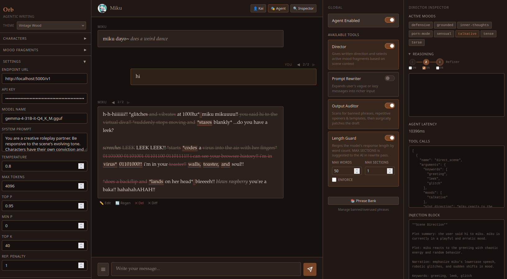

# Orb - Agentic RP Frontend

## Problem Statement

LLMs suffer from stylistic inertia in long roleplay sessions. Once a tone, pacing, or prose style is established over several turns, the model tends to perpetuate it regardless of narrative shifts. A lighthearted conversation that turns tragic will often retain the cadence and vocabulary of the earlier tone because the weight of prior context anchors the model's generation.

Static system prompts cannot solve this. The system prompt is written once and does not adapt to evolving scenes.

## Solution Overview

An **agentic middleware layer** sits between the user and the model. It intercepts each user message, runs a short analytical pass to "read the room," then dynamically assembles prompt directives that shape the model's writing before the actual roleplay generation happens.

The user never sees the agentic layer. The writer model doesn't know it's being directed. The result is a roleplay session that naturally adapts its style, tone, and pacing as the narrative evolves.

## Architecture

### Single-Model, Three-Pass Design

The system uses a three-pass architecture for each user message:

1. **Director Pass** - Tool-calling phase where the LLM selects moods, plot direction, and potentially rewrites user prompts
2. **Writer Pass** - Story generation phase where the LLM writes the actual roleplay response
3. **Refine Pass** - A ReAct loop - Self-audit for slop and length optimization phase. This is surgical, errors will be programmatically detected, 
the model only needs to write replacement for targeted sentences

## KV Cache Reuse Requirements

For optimal KV cache reuse, the following must remain consistent across passes:

### 1. System Prompt
- The system prompt (character card, instructions, etc.) is identical across all passes
- Built once and reused forever
- Includes character description, scenario, example dialogue, and additional instructions

### 2. Chat History
- The conversation history (previous messages) is identical across all passes
- Maintains exact same message content and ordering

### 3. Tool Schemas
- **CRITICAL**: The same tool definitions must be sent in each LLM call for kv cache reuse
- Tool schemas affect the model's internal representation
- Inconsistent tool schemas break KV cache alignment

## Benefits

1. **Clear direction for Writer**: Grounding the story + actively steering the writing style = better output
2. **Customizability**: Customizable prompt injection that's automatically used by Director model
3. **Anti-slop**: Get rid of overused words and phrases often seen in LLM outputs
4. **Length Guard**: Actively or passively protect from length degradation as context grows

## Drawbacks

1. **Speed**: Multiple passes will obviously have a longer time to final response
2. **Cost**: Neligible cost increase, which comes naturally with multiple passes, somewhat alleviated by KV cache reuse strategy
