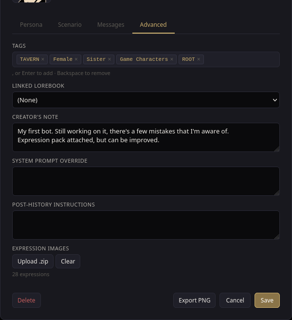
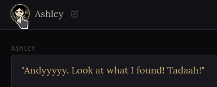

# Character Expressions

Give a character a set of portrait images, one per emotion, and Orb swaps the avatar to match the mood of what they just said. No animation, no video — just the right still image popping in at the right moment, like a visual novel.

## How it works

1. You upload a small set of images to a character, each one named after an emotion (`joy.png`, `anger.png`, `sadness.png`, ...).
2. While you chat, Orb reads the character's latest reply and figures out which emotion it best matches.
3. If you have an image for that emotion, the popup avatar switches to it. If you don't have that one but you do have `neutral.png`, it falls back to that instead. If neither exists, it just shows the character's normal avatar.

No image editing or special tooling needed — any picture named correctly and dropped in a `.zip` works.

## Supported expressions

Orb uses the same 28-label emotion set as SillyTavern's default expression sprites (the "go-emotions" set) for compatibility:

`admiration`, `amusement`, `anger`, `annoyance`, `approval`, `caring`, `confusion`, `curiosity`, `desire`, `disappointment`, `disapproval`, `disgust`, `embarrassment`, `excitement`, `fear`, `gratitude`, `grief`, `joy`, `love`, `nervousness`, `optimism`, `pride`, `realization`, `relief`, `remorse`, `sadness`, `surprise`, `neutral`

You don't need all 28 — upload however many you have. Missing ones just fall back to `neutral`, then to the plain avatar.

## Before you start: turn on the emotion classifier

Expression matching is powered by a small local model, not the chat model itself, so it needs to be downloaded once:

1. Open **Settings → Local ML**.
2. Find **Emotion Classifier** and download/enable it.

## Uploading an expression pack

1. Open the character's edit modal (click the character in your library, or the pencil/edit icon on their card) and go to the **Advanced** tab.
2. Find the **Expression Images** section and click **Upload .zip**.
3. Pick a `.zip` file containing your images, named after the emotions above (e.g. `Joy.png`, `ANGER.jpg` — names are case-insensitive and folders inside the zip are ignored, so a zip exported from SillyTavern works unmodified).
4. Orb tells you how many expressions it recognized. Uploading again fully replaces the previous set; **Clear** removes them all.

Supported image types: `png`, `jpg`/`jpeg`, `webp`, `gif`. Limits: up to 200 files per zip, 5 MB per image, 50 MB per zip.

## Spotting a character with expressions

Anywhere you see a character's avatar — the library list or the chat header — a character with an uploaded pack gets a halo ring around their portrait.

## Opening the expressions popup

Click the character's avatar in the chat header to open the popup. While it's open and the character has expressions uploaded, the portrait keeps re-checking the latest message roughly once per second and updates live, including while a reply is still streaming in.

