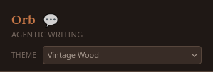

# Document Mode

A distraction-free plain-text editor that sits alongside Chat mode as a second way to use Orb. Chat mode is built around a character and a back-and-forth conversation; Document mode is just a blank page and a **Generate** button — good for freeform prose, one-shot stories, or raw prompt experimentation with no character card involved.

## Switching to it

Click the 💬/📄 button next to "Orb" at the top of the sidebar. The sidebar swaps Worlds/Characters for a **Documents** list, and the main pane swaps the chat view for a full-page editor. Whatever document you had open reopens automatically the next time you switch back.



## Documents

- **+ New Document** creates a blank one and opens it.
- Click a document in the list to open it; ✏ renames it, ✕ deletes it.
- Everything autosaves a second or two after you stop typing — the header shows **Saved** / **Unsaved…** / **Saving…** so you always know where you stand. Closing the tab mid-edit still flushes the save.
- The token count next to the title is a rough estimate of the whole document's length, not just the last generation.

## Generating

Put your cursor wherever you want the model to continue from and hit **Generate** (or Ctrl/⌘+Enter). Text streams in token by token and is tinted so AI-written text is visually distinct from your own — type anywhere, including inside a tinted run, and your keystrokes stay untinted. **Stop** (or Esc) cuts the stream off early. Each Generate adds up to your writer model's Max Tokens setting, shown live under "How to prompt."

## Raw vs. Assisted

A toggle at the bottom of the editor picks how your document becomes a prompt:

- **Raw** — sent to the model exactly as written, byte for byte. You type the chat template's own turn markers (e.g. `<|im_start|>user`) by hand and place the cursor right after the opening assistant tag. Full control, mikupad-style — best if you know your model's template.
- **Assisted** — write plain notes instead of template syntax. Lines starting `### SYSTEM:`, `### USER:`, or `### ASSISTANT:` are instructions; every other line is your story prose. Orb turns these into proper chat turns and lets the model's own template handle BOS/EOS and turn markers, so you never type them yourself.

```
### SYSTEM: You are a co-writer. Match the voice and style.
### USER: Write a story about a monkey. Ornate prose.
Once upon a time, beneath the gilded canopy…
### USER: Write tersely now. Short sentences.
The monkey woke. He▮
```

(Cursor at `▮`.) Click **How to prompt** in the editor for this same cheat sheet in context. Generation stops when the model ends its turn — often just a sentence or two — hit Generate again to keep going.

## Undo/redo

Ctrl/⌘+Z and Ctrl/⌘+Shift+Z (or +Y) undo/redo both your own typing and anything the model generated, on one shared timeline — backing out a bad generation and backing out a typo work exactly the same way.

Document mode works on mobile too, with the same editor, generation, and shortcuts (Undo/Stop are also available as on-screen buttons).
