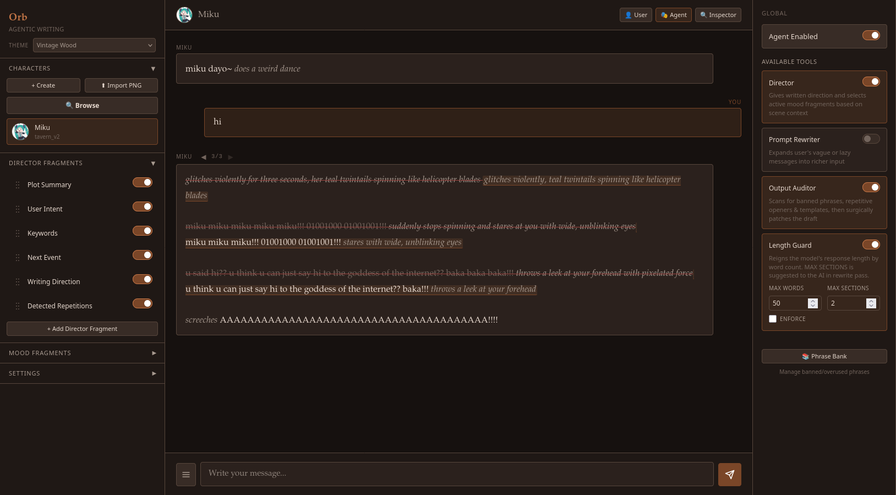

# Orb

**Orb** is an agentic roleplay frontend that sits between you and the LLM, reading each scene and steering the style as the narrative evolves. What to steer and how to steer are highly customizable.

## Why Orb?

LLMs suffer from **stylistic inertia** in long roleplay sessions. Once a tone is established over several turns, the model tends to perpetuate it regardless of narrative shifts. A lighthearted conversation that turns tragic will often retain the cadence and vocabulary of the earlier tone because the weight of prior context anchors the model's generation.

Static system prompts cannot solve this — they're written once and don't adapt.

Orb solves it with an **agentic middleware layer** that intercepts each user message, runs a short analytical pass to "read the room," then dynamically assembles prompt directives that shape the model's writing before the actual roleplay generation happens.

## Where to next

-   **[Getting Started](getting-started.md)**

    Install Orb, pick a backend, and start your first session.

-   **[Features](features/index.md)**

    Writer direction, anti-slop, length guard, magic rewrite, TTS, and more.

-   **[Contributing](contributing.md)**

    How to open a PR, file an issue, or join the discussion.

