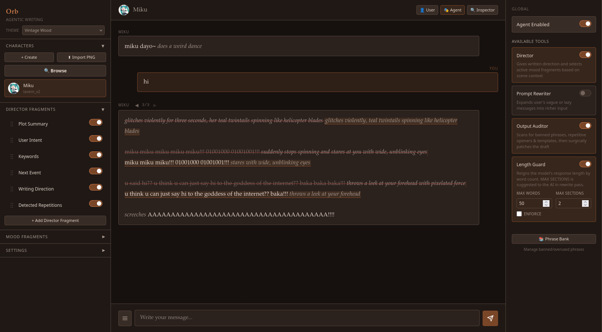

# Orb

Orb is a roleplay and writing app that connects your characters and conversations
to an LLM. It can also use optional local or cloud tools for scene direction,
editing, images, and speech.

## Start here

-   **[Getting Started](getting-started.md)**

    Install Orb, configure an LLM endpoint, and start a conversation.

-   **[Features](features/index.md)**

    Learn about direction, editing, writing tools, groups, and data management.

-   **[Multimedia](multimedia/index.md)**

    Set up image generation and text-to-speech.

-   **[Contributing](contributing.md)**

    Report a problem, suggest an improvement, or contribute code and docs.

