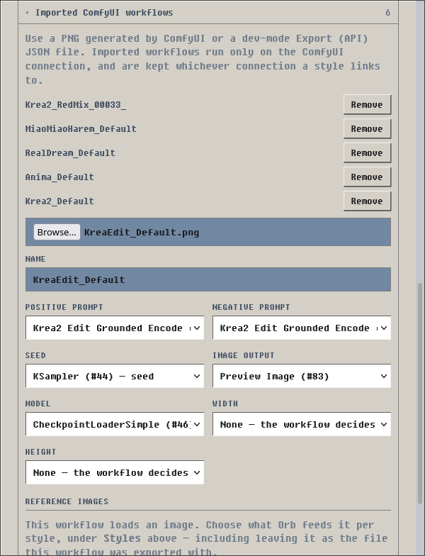

# Image Generation

Orb can generate an image of the current scene. You request each image on demand.

Orb renders through one of two backends, which you pick in settings:

| Backend | What it needs | What it costs |
|---|---|---|
| **External ComfyUI** | A ComfyUI server you run, a checkpoint, and an imported API-format workflow | Your own hardware and electricity |
| **Cloud API** | An API key | Money, per image, billed by the provider |

Orb does not install ComfyUI or image models. For a quick, out-of-the-box setup,
see [ComfyUI Setup](comfyui-setup.md). For a cloud provider, see
[Cloud Image Setup](cloud-image-setup.md). For ComfyUI hardware requirements and
advanced options, refer to the
[official ComfyUI documentation](https://docs.comfy.org/installation/system_requirements).

You pick the style for each gen, each style is linked to a backend/connection that
you must provide.

## Before you start

Make sure that you have these items:

- A working LLM endpoint in Orb
- Either a running ComfyUI server with at least one checkpoint and network
  access to it, or an API key for a supported cloud provider

Orb's Agent-lane LLM reads the conversation through the reply you selected and
writes the scene portion of the image prompt. It also sees the saved style and
character prompt blocks so it can avoid duplicating or contradicting them. It
does not see the generated image.

For **Tags** and **Hybrid**, Orb starts the final positive prompt with booru
character-count tags, then combines the saved style prompt, visible character
profile, and composed scene. For **Prose**, Orb omits booru count tags entirely
and describes the visible cast naturally. It assembles the negative prompt from
the character exclusions, scene-specific exclusions, and style exclusions. The
image model receives only those final prompt strings; it does not receive the
conversation, character card, or scene analysis.

## Enable image generation

1. Open **Workflow**.
2. Select the **Secondary** tab.
3. Turn on **Image Generation**.

The **Image Generation** card shows the current configuration status.

## Choose an image backend

First, this is what the UI look like (at least part of it):

1. Open **Workflow** and select the **Secondary** tab.
2. In the **Image Generation** card, select **Settings** (or **Finish Setup** if first time).
3. Open **Connections**. ComfyUI is always listed and cannot be removed; use
   **Add connection** for a cloud provider.
4. Fill in that connection, as below.
5. Select **Test connection**.
6. Under **Styles**, set each style's **Connection** to where it should render.
7. Select **Save**.

There is no global backend switch: each style names the connection it renders on,
so a local anime checkpoint and a commercial photorealistic API can sit side by
side in one conversation, one dropdown apart. Relinking a style swaps only the
fields that depend on the backend; every other field, and both backends' pins,
stay where they are.

### External ComfyUI

1. Start ComfyUI.
2. Enter the ComfyUI URL.
3. Enter an API key if your server uses a Bearer token.
4. Select **Test connection**.
5. Make sure that the result is **Connected**.

Use `http://127.0.0.1:8188` when Orb and ComfyUI use the same computer and the
ComfyUI port is `8188`.

A connection is not enough to render. Orb has no built-in workflow: each style
renders through a ComfyUI workflow that you import and assign. Until you do, the
status stays **Import a ComfyUI workflow**.

!!! note
    **Test connection** checks every style that has a workflow assigned. Each of
    those workflows must be valid, and a checkpoint is required when the workflow
    lets Orb override the model.

### Cloud API

1. Select a **Provider**.
2. Paste your **API key** for that provider.
3. Select **Test connection**. This lists the provider's models. It never
   generates an image, so it never costs anything.
4. In a style, select this connection, then pick a **Model** and a
   **Resolution**. Orb picks the closest aspect ratio or size the provider
   accepts and tells you on the image when the match is not exact.

The key is all a connection holds. The model, resolution, quality and reference
images are chosen per style, so two styles can share one key and one bill while
rendering with different models.

Full walkthrough, provider list, and what each provider supports:
[Cloud Image Setup](cloud-image-setup.md).

!!! warning
    A cloud provider is a third-party commercial API. Your scene prompts leave
    this machine, each image is billed to your account there, and the provider
    may retain what you send under its own retention policy. Orb asks you to
    confirm this the first time you save each provider, and asks again the first
    time you turn on reference images for it.

Orb keeps one API key per provider, so switching provider — and switching back —
does not lose a key you already pasted.

#### What a cloud provider does not do

Cloud image APIs expose far fewer controls than a ComfyUI workflow. The settings
panel states the gaps for the selected provider under the picker. For xAI, and
for most OpenAI-shaped providers:

| Not supported | What Orb does |
|---|---|
| Negative prompt | The prompter is told not to write one, so no model effort is spent on it. Orb still records the negative prompt on the image, so replaying that image on ComfyUI later is correct. |
| Seed | Orb still mints and stores a seed, because an image with no seed can never be rehydrated. **Render details** shows *Seed: not used* rather than a number the render never saw. |
| Steps, CFG, sampler, scheduler | Cloud providers expose none of them, so nothing is sent and nothing is recorded. |
| Exact width and height | Orb sends the nearest aspect ratio or size the provider accepts, and adds a note to the image when the difference is more than about 2%. |

Style prompts, the character appearance prompt, the camera, and the resolution
all still apply.

#### Cost

**Render details** shows what the provider's response reported about cost, in the
provider's own unit. xAI reports `usd_ticks` and does not document what a tick is
worth, so Orb prints `1400 usd ticks` rather than converting it to a dollar
figure it cannot verify. When a response reports no cost at all, Orb shows no
cost row — it does not print a zero.

Every **Reroll**, **Regenerate** and **Rehydrate** on a cloud backend is a new
billed image.

#### When a render fails

Orb relays what the provider answered, with the HTTP status in front of it —
*"NanoGPT rejected the request (HTTP 402): Insufficient credits"* — rather than
sorting failures into categories of its own. Credentials and internal paths are
stripped before the message is shown.

Commercial image APIs also moderate prompts, and a refusal arrives the same way,
quoting the provider's policy message. Rewording the scene, or a different
provider, is the only way through; there is no Orb-side setting that changes it.

## Import a ComfyUI workflow

Orb renders through ComfyUI workflows that you import. The ComfyUI server must
have all nodes and models that the workflow uses.

Orb accepts these files:

- An API-format JSON workflow
- A ComfyUI output PNG that contains workflow metadata

If you previously followed the tutorial in [ComfyUI Setup](comfyui-setup.md), import 
the .png file here.

A normal ComfyUI workflow JSON file is not an API-format file. In ComfyUI,
turn on the developer options. Then use **Save (API Format)** or **Export
(API)**. The exact label depends on your ComfyUI version. ComfyUI documents the
developer switch under [Comfy settings](https://docs.comfy.org/interface/settings/comfy).

To import the workflow, do these steps:

1. Open **Image Generation** settings.
2. Open **Imported ComfyUI workflows**.
3. Select the API-format JSON file or the ComfyUI PNG file.
4. Enter a name for the workflow.
5. Check the selected prompt, seed, image output, and model slots.
6. Optionally set **Width** and **Height**. See
   [Let Orb set the resolution](#let-orb-set-the-resolution) below. Both default
   to **None — the workflow decides**.
7. If the workflow loads images, check the list under **Reference images**. It
   names each **Load Image** widget the importer found. You choose what Orb feeds
   them per style, in step 10.
8. Select **Confirm slots and add workflow**.
9. In a style, select the imported workflow.
10. If the workflow loads images, set each row under **Reference images** on that
    style. See [Reference images](#reference-images) below. Leave a row **Off** to
    keep the file the workflow was exported with.
11. If your workflow is complex, review the nodes - make sure Orb points to the right node numbers.
12. Select a checkpoint if Orb must replace the model in the workflow.
13. Select **Test connection** to validate everything works.
14. Select **Save**.

### Let Orb set the resolution

A ComfyUI workflow normally decides its own output size, and Orb leaves it that
way unless you say otherwise. Mapping **Width** and **Height** at import hands
that control to the style's **Resolution** picker instead.

Map them when the workflow has a plain latent node whose size you would otherwise
edit in ComfyUI — typically an **Empty Latent Image** in a text-to-image graph.

Leave them as **None** when:

- The workflow takes its size from a reference image, an aspect-ratio node, or a
  resolution helper. There is nothing to set, and setting an early latent would
  not change what comes out.
- Your checkpoint has a native resolution. Many SD 1.5 and SDXL checkpoints
  degrade badly away from theirs, and the workflow's author already picked a size
  that works.

Orb offers only inputs literally named `width` and `height`, so a numeric input
like `grounding_px` is never proposed. Both must be mapped together — half a size
is not a size.

The **Resolution** field appears on a style only while its assigned workflow maps
both. If you set a non-default resolution on a style whose workflow maps neither,
the image says so under **Render details** rather than quietly ignoring it.

If a PNG does not contain workflow metadata, export an API-format JSON file
from ComfyUI instead.

## Reference images

### On a cloud provider

Set **Reference images** on the style. It is **off** by default: sending images
from your conversations to a third party is opt-in. Because it is a style
setting, one style on a provider can send references while another on the same
key does not.

When it is on, Orb routes the render to the provider's image-edit endpoint and
sends the resolved image inline with the request. Orb converts it to a format the
provider accepts first — generated images are stored as WebP, and most providers
take only PNG and JPEG. The size limit for a cloud reference is 4 MB, smaller
than ComfyUI's, because the image is base64-encoded inside a JSON request body.
Orb resizes and re-compresses to stay under that limit; if it cannot, the render
fails and says so rather than sending an oversized request.

The source choices are the same three listed below. Providers that accept only
one reference image are sent the first, and Orb notes it on the image.

A cloud reference is optional. When no source resolves — a new conversation with
no images yet, and no character reference — the render goes to the plain
generation endpoint instead, and the image says so under **Render details**. This
is the one difference from ComfyUI, where a workflow built around a **Load
Image** node cannot render at all without one.

### On ComfyUI

Edit workflows - Qwen-Image-Edit, Flux Kontext, Krea Identity Edit, IPAdapter -
take one or more input images through **Load Image** nodes. Orb fills those
nodes for you: each render uploads the image to ComfyUI and points the node at
the uploaded file. Orb fills only the **Load Image** nodes the workflow already
contains and never adds nodes, so a workflow that takes two reference images
must be exported with two **Load Image** nodes.

Set **Reference images** on the style, the same place a cloud style sets it. The
style shows one row per **Load Image** widget its assigned workflow declares, and
each row is **off** by default. Because it is a style setting, two styles can
share one workflow and feed it differently - one drawing on the chat, another
rendering from the prompt alone - and you can change your mind without
re-importing the workflow.

A row left **Off** keeps the filename the workflow was exported with. That file
has to exist on your ComfyUI server, and **Test connection** says so if it does
not.

Each reference row offers these sources:

| Source | What Orb sends |
|--------|----------------|
| **Previous image, else character reference** | The most recent image in the chat. If the chat has none, the character reference image. |
| **Previous image in the chat** | The most recent image in the chat. |
| **Character reference image** | The character reference image. |

The previous image is the most recent generated image or uploaded image before
the reply you are visualizing. If a reply has image variants, Orb sends the
variant that is currently shown. Orb never sends the image already attached to
the reply you are visualizing. When no source resolves on ComfyUI, the render
fails and names the slot - Orb does not substitute a different image.

Orb looks back at most 30 messages on the branch. Past that, **Previous image,
else character reference** falls through to the character reference: a picture
from far earlier in the conversation is usually a different scene, and often a
different character, so the likeness you set on purpose is the better answer.

Uploads count only in the formats Orb accepts - PNG, JPEG and WebP. An upload in
any other format (a phone HEIC, for example) is skipped and the search continues
to the next image.

!!! note
    These workflows take the output size from the reference image or from a
    resolution node, so the output aspect ratio follows the reference image
    rather than the resolution you set.

### Set the character reference image

1. Open a conversation with the character, then open **Image Generation**
   settings and find **This Character Only**.
2. Under **Reference image**, select a PNG, JPEG or WebP file. The limit is 10 MB.
3. Select **Save**.

When you set no reference image, Orb sends the character card's avatar.

A file in another format, or over the limit, is not saved. Orb tells you so
rather than accepting the save and dropping the image.

### Reference images and reroll

Reroll changes the seed only. Orb records where each reference came from and
fetches the same image again, so the picture keeps its subject. A character
reference is re-read from the character profile, so changing it and rerolling
applies the new image.

Rerolling under a different style carries the references over. Orb records an
*origin* - a chat image or a character card - not a slot in one workflow, so it
re-points them at whatever the new style loads them into, including across
backends. Two cases still fail, and both say why: the source image was deleted or
its bytes were evicted, or the new style needs a reference the stored image never
recorded. Use **Regenerate** for those.

Two cases re-render with a note instead of failing:

- The new style takes no reference images at all. The reference is not sent, and
  the picture will not match.
- The new style takes fewer than the original recorded. The extras are not sent.

If the image an origin points at has since been replaced - by rehydrating an
evicted image on a backend that does not honour seeds, for example - the reroll
fails rather than quietly using a different picture.

!!! warning
    A ComfyUI server that is not on this machine receives your conversation
    images and your character reference image, not only your prompts. Orb asks
    you to confirm this the first time you save a remote server with a workflow
    that uses reference images. Uploaded files stay in that server's
    `input/orb/` directory - ComfyUI has no delete API for them.

## Make an image

1. Open **Workflow** and select the **Secondary** tab.
2. In the **Image Generation** card, select a style.
3. Find the assistant reply that you want to show as an image.
4. Select the image button. Its tooltip is **Visualize reply**.
5. Wait for Orb and ComfyUI to complete the image.

Orb shows the current phase. The phase can be prompt composition, queue wait,
or rendering. If another render is before your render, Orb shows the number of
renders in front of it.

Select the image button again to cancel an active render.

## Use image variants

The image has two action buttons:

| Action | Result |
|---|---|
| **Reroll** | Orb uses the stored prompt and settings. It uses a new seed. See [Edit the prompt manually](#edit-the-prompt-manually). |
| **Regenerate** | Orb writes a new prompt. It uses the current style and character settings. |

Orb keeps each result as a variant. Use the left and right arrows to view the
variants. The counter shows the active variant.

### Reroll and rehydrate on a cloud backend

**Reroll** works as it always did. Its promise is "same prompt, different image",
and a provider with no seed is nondeterministic anyway — so a fresh call *is* a
reroll.

**Rehydrate** cannot keep its promise. It exists to restore the exact bytes of an
image whose data was evicted from the cache, and it does that by re-rendering
from the stored seed. A provider that ignores seeds returns a *different* image.
Orb re-renders and says so on the attachment, rather than refusing:

> this provider takes no seed: a fresh render of the same prompt, billed as one,
> not the original image

Rehydrate on a cloud backend costs money, for the same reason a generate does.

### Switching backend with old images

Rerolling an image that was generated on the other backend re-renders it on the
one selected now, and notes the substitution on the result. Orb does not refuse:
a refusal would surface only as a generic server error, and the image you get is
still the prompt you asked for.

An image replays at the resolution it was generated at, not the resolution
currently in the picker, on either backend. Changing the picker does not
retroactively resize old images.

Open **Render details** to see the style, seed, prompt, and negative prompt.
Select the style name in these details to edit that style.

Use the delete button in the image header to remove a variant or its variant
group. Read the confirmation message before you continue.

## Edit the prompt manually

The prompt that the prompter model wrote is not final. You can correct it and
render the correction.

1. Open **Render details** under the image.
2. Select the pencil next to **Prompt** or **Negative**.
3. Edit the text.
4. Select outside the field. Orb shows **Prompt edited — reroll to render**.
5. Select **Reroll**.

Orb renders your text as written. The prompter model does not run again.

**Reroll** also takes the style that is selected in the **Image Generation**
card at that moment, not the style that made the original image. The style
supplies the checkpoint and the ComfyUI workflow. Set the style you want before
you reroll.

Style tags are already baked into the stored prompt text, so a new style does
not reword it. When the style changes, Orb adds a note to **Render details** to
say that the prompt text still carries the previous style's wording. Edit the
tags in the prompt field yourself if you want them to match.

The edit stays with the attachment until you replace it, so a failed reroll does
not lose your text. **Regenerate** ignores the edit: it writes a new prompt.

## Set the character tags (Optional)

Allow user-defined appearance tags to always come with the character. A common use case 
is name of a non-OC character, some image models do better with canon character names.

1. Open a conversation with the character.
2. Open **Image Generation** settings.
3. Find **This Character Only**.
4. Enter comma-separated appearance tags in **Positive prompt**.
5. Enter unwanted character features in **Negative prompt**.
6. Select **Save**.

Use fixed and visible details. For example, specify hair, eyes, body shape, and
usual clothes. Do not add a character-count tag such as `1girl`. Orb gets the
character count from the scene.

Negative tags apply only to this character profile. Style and scene negative
tags are separate.

This section also holds the character's reference image. See
[Set the character reference image](#set-the-character-reference-image).

## Change a style

Orb ships **Realistic** and **Anime** styles out of the box. A style contains these items:

| Item | Function |
|---|---|
| **Name** | Sets the name in the style list. |
| **Prompt format** | Chooses tags, hybrid tags and clauses, or prose for the scene portion. Tags and Hybrid use `1girl`/`1boy` count tags; Prose never does. Match this to the text encoder in the imported workflow. The style list and the tools-panel picker show the format after the name, for example `Krea-Alt (Prose)`. |
| **Positive style tags** | Adds visual properties near the start of the image prompt. |
| **Negative style tags** | Appends properties that ComfyUI must avoid. |
| **Extra instructions** | Gives composition or emphasis guidance to the prompter model. This is not copied into the image prompt. |
| **Connection** | Selects where this style renders: the ComfyUI server, or one of your cloud connections. |
| **Checkpoint** | Selects the model file on the ComfyUI server. ComfyUI only. |
| **Workflow** | Selects the ComfyUI workflow for this style. ComfyUI only. |
| **Model** | Selects the model this style renders with. Cloud only. Leave it on the provider's default if you have no preference. |
| **Resolution** | Sets the output size. Always shown for a cloud connection; on ComfyUI, only when the assigned workflow has **Width** and **Height** slots mapped. |
| **Quality** | Sets the provider's quality tier, on providers that expose one. Cloud only. |
| **Reference images** | Chooses what Orb feeds each image input this style's render target has - one on a cloud provider, one per **Load Image** widget on a ComfyUI workflow. Off by default. See [Reference images](#reference-images). |

A style owns everything that decides what the image looks like. A connection owns
only how Orb reaches a backend — a URL and a key.

That means two styles on one cloud provider can use two different models: point
**Realistic** at a photographic model and **Anime** at an illustration one, both
on the same API key. Same for resolution, quality and reference images.

Every one of these fields is kept on the style whichever connection it links to,
so switching a style to a cloud provider and back leaves its workflow pin,
checkpoint and model exactly where they were.

The **Realistic** and **Anime** rows are seeded with starting tags that you can
edit or clear like those of any other style. Empty tag fields add no style tags.

To add a style, do these steps:

1. Open **Image Generation** settings.
2. Select **Add style**.
3. Enter a name and the style tags.
4. Select a connection.
5. For ComfyUI, select a checkpoint and a workflow. For a cloud provider, select a
   model and a resolution.
6. Select **Test connection**.
7. Select **Save**.

A new style starts from the previous one's settings, so a variation on an
existing style is usually two fields away.

You must keep at least one style.

## Set the camera (POV)

The camera decides whether the image looks *through* the user's eyes or *at* the
scene from outside. Orb decides it before it writes the prompt, then gives the
prompter one set of instructions written for that camera only.

Set it in the **Image Generation** card, next to the style picker. The choice is
global, like the style: it applies to every conversation until you change it.
Leave it on **Auto** if your chats are written in different persons.

| Mode | Result |
|---|---|
| **Auto** | The local POV classifier reads the reply. First- and second-person narration give the first-person camera; third-person narration gives the third-person camera. |
| **First-person** | Always through the user's eyes. The user is not drawn. |
| **Third-person** | Always from outside. Every person in frame is drawn, including the character the user plays. |

Orb decides the camera in this order. The first match wins:

1. The **First-person** or **Third-person** mode on the picker.
2. The classifier, in **Auto** mode. If a reply is too short or too mixed to read,
   Orb reads the previous assistant replies until one is clear.
3. Third-person.

A camera tag such as `first_person` in the character's **Positive prompt** no
longer sets the camera — use the picker.

Each image records which camera it used and which lever chose it. Open **Render
details** under the image and read the **Camera** row: *picker*, *classifier* or
*default*. It names where to go to change a camera you did not want.

### Turn on the POV classifier

**Auto** needs a small local model. Without it, **Auto** falls back to
third-person and the picker says `Auto (classifier off)`.

1. Install the machine-learning extras. See [Character Expressions](../features/character-expressions.md).
2. Open **Settings** and find **Local ML**.
3. Select **Download** on **Image POV**. The model is about 20 MB.
4. Leave the toggle on.

The model runs on the CPU inside Orb. It sends nothing to a server.

## Analyze a complex scene

Turn on **Analyze complex scenes** when a scene has multiple characters or
important positions. Orb first identifies the visible characters, clothes, and
positions at the final visible instant. Orb then converts that structured scene
to the selected prompt format. The second pass treats the extracted scene as
data, so dialogue or instructions inside the roleplay do not become prompt
instructions.

This option makes one additional LLM call for each new image or regenerated
image. A reroll uses the stored prompt and does not make this additional call.

## Enable prompter thinking

Turn on **Enable prompter thinking** when the Agent model benefits from reasoning
before it analyzes the scene or writes the diffusion prompt. The setting applies
to both prompt calls: the optional complex-scene analysis and the always-on prompt
composition call.

The prompter always uses Orb's Agent model lane. In single-model mode this is the
same endpoint and model as the Writer. In dual-model mode it uses the configured
Director/Editor endpoint, model, system prompt, and reasoning-effort setting.

Changing thinking mode can reduce prompt-cache reuse on providers that keep
thinking and non-thinking requests in separate cache lanes. Keeping the setting
stable gives the two prompter calls the best chance to reuse one another. Matching
the Editor setting may also improve reuse when an Editor-side call ran recently,
but provider behavior and the prompter's separate tool schemas mean this is not
guaranteed.

## Solve common problems

| Problem | Action |
|---|---|
| The image button is not shown. | Turn on the workflow. Use an assistant reply without an image. Make sure that this tab has write control. |
| The status says **Import a ComfyUI workflow**. | Import a workflow under **Imported ComfyUI workflows**. Assign it to each style. |
| The status says **Choose a checkpoint**. | Open each style whose workflow overrides the model. Select a checkpoint. |
| The connection test fails. | Make sure that ComfyUI is running. Check the URL, port, firewall, and API key. |
| Orb cannot find a checkpoint. | Add the checkpoint to ComfyUI. Restart or refresh ComfyUI. Test the connection again. |
| ComfyUI rejects the workflow. | Check that the server has all required nodes. Check the selected checkpoint and imported slots. |
| The render times out. | Check the ComfyUI queue. Increase **Render timeout**. The allowed range is 10 to 900 seconds. |
| A render says it needs a reference image. | Generate or upload an image in the chat first. Or set a character reference image, and set the slot to a source that includes it. |
| A reroll says the reference image is gone. | The source image was deleted or its bytes were evicted. Select **Regenerate**. |
| A reroll says the reference image was replaced. | The image that origin points at now holds different bytes, so the reroll cannot reproduce the picture. Select **Regenerate**. |
| A reroll says the style needs a reference the image did not record. | That style loads more images than the stored one recorded. Select **Regenerate** under that style. |
| A render says the reference image could not be read. | Orb accepts PNG, JPEG and WebP. Replace the upload or the character reference image. |
| A render says the reference image is too large after resizing. | Use a smaller source image. Cloud providers cap a reference at 4 MB once encoded. |
| A reference image was not saved on the character. | Orb accepts PNG, JPEG and WebP up to 10 MB. |
| The connection test says a node needs an image on the server. | The message names the style. Either point that slot at a source under that style's **Reference images**, so Orb overwrites the filename, or put the file in ComfyUI's `input` directory so the style that leaves the slot **Off** can render it. |
| ComfyUI completes without an image. | Select a valid image-output node in the imported workflow. |
| Orb cannot write an image prompt. | Check the Orb LLM endpoint. Use a model that can make tool calls. |
| An old image shows **Bytes evicted**. | Select **Rehydrate**. Orb uses the stored prompt, settings, and seed to make the image again. On a cloud backend this is a fresh billed render, disclosed on the image. |
| The status says **Paste an API key**. | Open settings, open **Connections**, and paste the key for that provider. |
| The status says **Choose a … model**. | Open the style and select a **Model**, or pick a provider that ships a default. |
| The **Resolution** field is missing on a ComfyUI style. | Its workflow maps no size slots. Re-import the workflow and set **Width** and **Height**, or leave the workflow to decide. |
| An image says the workflow decides its own output size. | You set a non-default resolution on a style whose workflow maps no size slots. Either re-import it with **Width** and **Height** mapped, or set the style back to 1024x1024. |
| The status says **Unknown image provider**. | The stored provider id is not in Orb's table. Pick a provider from the list. Your key is kept, not deleted. |
| The provider says the API key was rejected. | Check the key, and check that it is enabled for image generation on the provider's dashboard. A 403 can also mean your plan does not cover the model; the provider's own message says which. |
| A render failed with **HTTP 4xx** and the provider's message. | The provider understood the request and refused it. The message is theirs — a content policy, an unsupported parameter, an exhausted balance. Act on what it says. |
| A render failed with **HTTP 429**. | Rate limit *or* exhausted quota, depending on the provider. The message says which; wait, or check your plan's limits. |
| A render failed with **HTTP 5xx**. | The provider's own failure, not your configuration. Try again; if it persists, check the provider's status page. |
| The provider **did not respond within** the timeout. | The render exceeded Orb's timeout. Large resolutions and busy models are the usual cause; try again or pick a faster model. |
| A cloud image came back the wrong shape. | The provider renders fixed aspect ratios. **Render details** names the ratio it used. Pick a resolution closer to one the provider supports. |
| **Seed** says *not used*. | Expected. The provider ignores seeds; the stored seed exists so the image can still be rehydrated. |

The ComfyUI queue can continue a submitted job after the browser disconnects.
If you cancel a render, check the ComfyUI queue before you start another render.
